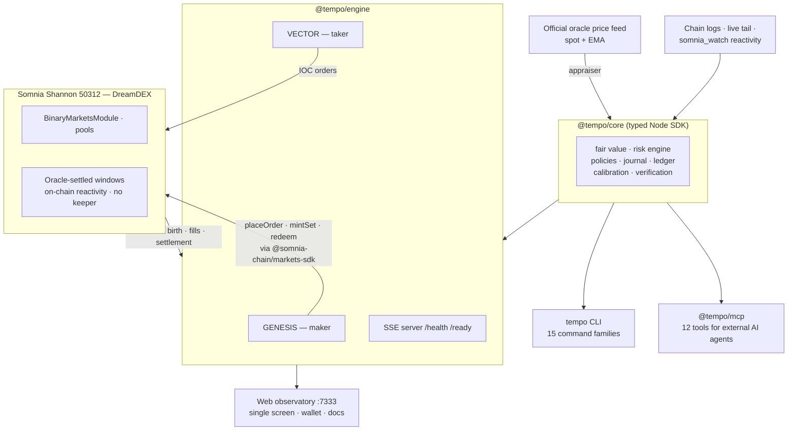

<div align="center">

  

  # TEMPO

  

  <b>⚡ Every DreamDEX Event Contract is born with an empty book. TEMPO is the opening auction. ⚡</b>

  <br /><br />

  
  
  
  
  
  

  <br />

  <a href="https://github.com/Kevincruz2005/Tempo">🐙 Repository</a> •
  <a href="#-on-chain-proof">📜 On-Chain Proof</a> •
  <a href="SUBMISSION.md">📋 Submission</a> •
  <a href="docs/DESIGN.md">📐 Design Doc</a>

</div>

---

## 📑 Table of Contents
- [Firm Statistics](#-firm-statistics)
- [Why TEMPO Matters](#-why-tempo-matters)
- [Why Somnia? Why DreamDEX?](#-why-somnia-why-dreamdex)
- [The Mechanism](#-the-mechanism)
- [The Agent Firm](#-the-agent-firm)
- [Verifiable Trading Intelligence](#-verifiable-trading-intelligence)
- [System Architecture](#-system-architecture)
- [On-Chain Proof](#-on-chain-proof)
- [Developer Surface](#-developer-surface)
- [Repository Structure](#-repository-structure)
- [Installation & Local Setup](#%EF%B8%8F-installation--local-setup)
- [Next Milestones](#-next-milestones)

---

## 📊 Firm Statistics

*All figures journal-derived from live operation on Somnia Shannon testnet (24 h window, 2026-09-02) or independently re-run for this README — nothing simulated, nothing projected.*

| Metric | Value |
|:---|:---|
| Live venue | **DreamDEX Event Contracts** — Somnia Shannon (chain 50312) |
| Windows observed born (24 h) | **369** (BTC 192 / ETH 177) |
| Agent decisions journaled (24 h) | **6,274** — every one with its full inputs |
| Real orders sent (24 h) | **168** → **120 unique transaction hashes** |
| On-chain fills / settlements claimed | **10 / 3** |
| Transaction verification sample | **31/31 hashes checked on-chain, 0 failures** (`tempo verify`) |
| Fair-value calibration snapshot | **Brier 0.0723** · 100% directional on scored markets |
| Operational errors journaled | **996 — firm crashes: 0** |
| Automated tests | **2,107 passing** (17 files) |
| Security | `npm audit`: **0 vulnerabilities** · CycloneDX SBOM · SHA256 checksums |
| Mocked economic values | **0** — audited |

---

## 💡 Why TEMPO Matters

DreamDEX creates a brand-new prediction market every minute — BTC/ETH Up/Down over windows from 60 seconds to 24 hours. Each window is born with an **empty order book**, a published **on-chain opening price**, and a hard expiry. We verified the consequence on-chain: finalized windows appear with `tradeCount: 0` — markets that lived their entire life without ever having a price.

Traditional exchanges solved this centuries ago with the **opening auction**. The venue's own bot kit quotes the mid of an *existing* book (falling back to `0.5` at birth) on a 10-second poll — nobody anchors the birth, because no human can economically staff a market that dies in 60 seconds.

**TEMPO is the autonomous opening auction**: an agent firm that attends every window's birth, anchors it with derived two-sided liquidity, reacts at machine speed, manages the endgame, settles, claims, and rolls. A rolling sequence of ephemeral windows becomes **one continuously liquid market**.

**No human market maker or external keeper is required. Market updates react to live events rather than polling.**

---

## 🔴 Why Somnia? Why DreamDEX?

**Somnia is load-bearing, not a deployment target:**

- **~100 ms blocks, sub-second finality, negligible gas** — continuous re-quoting across all live windows is economical; on Ethereum the gas per cancel/replace would exceed the edge per quote.
- **`somnia_watch` off-chain reactivity** — book/fill events arrive with same-block read results attached; the quoter reacts in the block era, not on a timer.
- **One-round-trip writes** — `realtime_sendRawTransaction` confirms send + receipt in a single round trip.
- **Keeperless settlement** — DreamDEX resolves windows by delivering oracle answers to market contracts through Somnia's **on-chain reactivity**. No keeper, no cron.

**DreamDEX Event Contracts are the mechanism, not a feature:**

- the **on-chain opening price** is the anchor the whole fair-value model is built on
- the **mint-a-pair path** enables two-sided quoting with **zero inventory**
- **mandatory order expiry** (capped at the window's own) is a built-in dead-man's switch for autonomous agents
- the **`Finalized` lifecycle** provides the settlement/claim/roll path

Remove either and TEMPO has nothing to attend.

---

## 🚀 The Mechanism

```text
BIRTH     window deploys → discovered the block it lands (chain-log live tail)
ANCHOR    fair value = Φ( ln(spot/strike) / (σ√t) ) from the official oracle
          feed vs the on-chain opening price — BEFORE any book exists
GENESIS   two-sided quote with ZERO inventory (resting Buy Up at p−δ +
          Buy Down at (1−p)−δ — the venue mints the pair on cross)
REPRICE   event-driven: fills, price ticks, time decay → cancel/replace
          in the same block era; inventory skew bends the mid
ENDGAME   spread tightens with √time; quotes skew toward certainty
SETTLE    the chain resolves the window (on-chain reactivity — no keeper)
CLAIM     winnings redeemed on-chain (void-aware: both sides at 0.5)
ROLL      successor window appears → back to BIRTH
```

---

## 🤖 The Agent Firm

Two independent agents, separate keys, separate capital, genuinely different policies over the same live inputs — so they *disagree*, and the disagreement is real trading.

| Agent | Role | Policy summary |
|:---|:---|:---|
| **GENESIS** | Liquidity-genesis maker | Anchors newborn windows with zero-inventory two-sided quotes; re-prices reactively; manages the endgame; claims and rolls |
| **VECTOR** | Adversarial taker | Runs its own fair-value estimate; takes IOC liquidity when the touch deviates beyond its edge threshold; stands down otherwise |

Every order from either agent passes the same deterministic **`RiskEngine`** before signing: per-window inventory caps, per-order collateral caps, firm capital limits, tick/lot grid alignment, expiry headroom, mandatory order expiry. During the recorded 24 h window the engine rejected an order that would have breached the inventory cap — the safety boundary working, on-chain-verifiable in the journal.

**Intentionally no LLM in the hot path** — these markets move on Somnia's ~100 ms blocks, so sending each pricing or execution decision through a remote LLM would introduce significant network latency, variable response times, rate limits, and performance loss. The hot path therefore uses a deterministic quantitative model for consistent machine-speed execution. An optional LLM narrates reports from journal facts only, labeled `AI NARRATIVE`.

---

## 🧠 Verifiable Trading Intelligence

TEMPO doesn't ask you to trust a black-box trader. It leaves evidence.

1. **Every estimate is journaled before action** — spot, strike, σ, time, computed probability — labeled `QUANTITATIVE ESTIMATE`. Chain reads are labeled `CHAIN FACT`.
2. **Every settlement is an on-chain fact.**
3. **The firm grades itself** — each resolved market scores the appraiser's last pre-expiry estimate against the actual winning outcome:
   - **Brier score: 0.0723** across 3 scored markets (0 = perfect, 0.25 = coin-flip)
   - **Directional accuracy: 100%** on that evaluation snapshot
4. **The firm learns within hard bounds** — a deterministic calibration loop adjusts exactly two pricing parameters (σ multiplier, taker edge), clamped to **0.5×–2×** of operator defaults, one adjustment per ≥25-market epoch, every adjustment journaled with its reason.

Autonomous. Bounded. Auditable.

---

## 🏛️ System Architecture



**One core. Three surfaces. No duplicated trading logic.**

---

## ✅ On-Chain Proof

**All transactions below are real, live on [shannon-explorer.somnia.network](https://shannon-explorer.somnia.network), and independently verifiable via `tempo verify` (31/31 checked, 0 failures).**

Funded lifecycle of market `0x…010fad` — 2026-09-02:

| Step | Agent | Transaction |
|:---|:---|:---|
| Testnet collateral minted | GENESIS | [`0x7a78a4…`](https://shannon-explorer.somnia.network/tx/0x7a78a4f4ca13cc59c94ee6d1a78c03bead20112ef71ae1adcd1f3850b4f6561a) |
| Testnet collateral minted | VECTOR | [`0xb51c35…`](https://shannon-explorer.somnia.network/tx/0xb51c35c96f3bcd8b061c4f956b946d2177d1276f7ca1c9849ee16aeb160375b1) |
| Complete set minted | GENESIS | [`0xe4cfac…`](https://shannon-explorer.somnia.network/tx/0xe4cfacbcccf7100a16bdec6d91b77b7a36d1137125cd6f072115b05c14c31710) |
| Post-only anchor quote resting | GENESIS | [`0x61df88…`](https://shannon-explorer.somnia.network/tx/0x61df8841b3fe0b505415ce28f983c888f24c8bce712d32003cdce6416af9e0b7) |
| Requote — stale order cancelled | GENESIS | [`0xec1a64…`](https://shannon-explorer.somnia.network/tx/0xec1a645007bc031ddf1ea16e5d21b1bdf6291f634dee9c03955c37f1506028ed) |
| Post-only sell (inventory side) | GENESIS | [`0x55343b…`](https://shannon-explorer.somnia.network/tx/0x55343bb33a3683fd4077f28e724e931b7d9977b7e0d812252369a8f05268ac23) |
| **IOC take — real fill** | **VECTOR** | [`0x3d2cc4…`](https://shannon-explorer.somnia.network/tx/0x3d2cc41de74db30eb8811609cdee105e9657a7dce2b463236b3a5618a6b26079) |

…continuing through settlement observation, on-chain redemption, and the automatic roll. Full ledger with block numbers and timestamps: [`test/reports/full-onchain-mode.md`](test/reports/full-onchain-mode.md).

<details>
<summary><b>DreamDEX protocol contracts TEMPO trades through (CREATE3 — identical on testnet 50312 and mainnet 5031)</b></summary>
<br>

| Contract | Address |
|:---|:---|
| BinaryMarketsModule | [`0x3ecC694Cef705358864a646142ac17A90E29e388`](https://shannon-explorer.somnia.network/address/0x3ecC694Cef705358864a646142ac17A90E29e388) |
| MarketsCore | `0x2802504314685D89bF6C992CA5a8e7cC78bc0294` |
| BinarySettlement | `0xbF4a49e0Dfd092e5FBE8E5761064C49533e6Ed23` |
| OutcomeToken6909 | `0xB52c5934113Af5c0Bb20eb3C72290C8215f755b9` |
| OracleHub | `0xe40db387cC98601Dd11bd634fF2f3AD5686dE32b` |
| CollateralRouter | `0xbC0C9834B15ACE38bB50dDaa7d7f7C7CC4DC183C` |
| Collateral (testnet tUSDC, 6 dec) | `0x70a86D8842FB63C4Ad2b7cdddF530eBf1BB25d8E` |

*Per-market contracts (market + pool) are read from the module registry at runtime — never hardcoded; pools are recycled across windows. Decimals, venue IDs, and tick/lot grids are all derived from the chain.*

</details>

> The firm runs with **zero mocked state**: every displayed value carries a provenance class (`price-feed` · `on-chain` · `policy` · `derived`); unavailable data renders honestly as `UNAVAILABLE` / `NO DATA` / `PENDING`. Audit: [`test/reports/zero-mock-audit.md`](test/reports/zero-mock-audit.md).

---

## 🧰 Developer Surface

### `tempo` CLI — 15 command families / 16 documented subcommands

```bash
tempo doctor            # probe chain / indexer / feed / keys (read-only)
tempo markets           # live windows: series, seconds-left, venue
tempo book <frag>       # one window's book + strike + spot + grid
tempo watch             # streaming book view (live tail)
tempo agents            # firm roster + balances
tempo positions         # outcome balances per agent
tempo firm simulate     # run the firm — decisions journaled, nothing sent
tempo firm start        # run the firm for real (funded keys)
tempo trade <frag> <up|down> <qty>   # manual IOC order
tempo claims [--claim]  # settled markets + redeem winnings
tempo settlements       # recently settled windows + oracle links
tempo activity          # journal tape: events → decisions → txs
tempo verify            # cross-check every journal tx hash on-chain
tempo report [--llm]    # firm report from the journal (Brier + execution stats)
tempo calibrate         # run a calibration epoch on demand
```

### `@tempo/core` — typed Node SDK (v0.2.0)

Strict TypeScript, CycloneDX SBOM, SHA256 checksums, clean-environment consumer-verified. Config, exchange wrapper across **all three `@somnia-chain/markets-sdk` tiers** (unified / client / trader), fair-value engine, risk engine, policies, journal, ledger, calibration, report generation. Full API reference on the docs page (`/docs.html`).

### `@tempo/mcp` — 12 MCP tools for external AI agents

10 read tools (`discover_markets`, `inspect_event_contract`, `get_live_book`, `get_fair_value`, `get_settlement`, `verify_receipt`, …), an always-dry-run `simulate_trade`, and an opt-in `place_order` gated behind `TEMPO_MCP_WRITES=true` that still routes through the same `RiskEngine`. Schema-validated, journaled, zero key exposure.

### Web observatory — one screen, zero page scroll

Live windows · materialized books · fair-value band · firm roster · activity tape with real tx hashes · settlement feed with oracle-explorer audit links · SSE live stream · Connect Wallet (pre-sign summary, read-only address watching) · `/health` + `/ready`.

---

## 📂 Repository Structure

```text
├── packages/
│   ├── core/              # @tempo/core — typed SDK: fair value, risk, policies,
│   │                      #   journal, ledger, calibration, exchange (3 SDK tiers)
│   ├── engine/            # @tempo/engine — GENESIS + VECTOR firm, SSE server,
│   │                      #   health/readiness, wallet order preparation
│   ├── cli/               # tempo CLI — 15 command families / 16 subcommands
│   ├── mcp/               # @tempo/mcp — 12 MCP tools for external AI agents
│   └── web/public/        # single-screen observatory + docs page
├── test/                  # 2,107 tests: unit · sdk · integration · contract ·
│   │                      #   e2e · failure · security · economic · cli · reports/
├── docs/                  # DESIGN · RECONNAISSANCE · SECURITY · research corpus
├── release/               # SDK tarballs · CycloneDX SBOMs · SHA256SUMS
├── probe/                 # read-only live venue probes
├── SUBMISSION.md          # hackathon submission description
└── originality_package.md # pitch reframe · differentiation table · demo script
```

---

## 🛠️ Installation & Local Setup

**Requires Node ≥ 20. No keys needed for read-only / dry-run.**

```bash
git clone https://github.com/Kevincruz2005/Tempo.git
cd Tempo
npm install
cp .env.example .env

npm test                  # 2,107 tests — includes live read-only venue checks
npm run firm              # dry-run firm + observatory → http://localhost:7333
```

**Going live on Shannon testnet** (real transactions, testnet funds):

```bash
# 1. Generate two funded keys (faucet: t.me/+XHq0F0JXMyhmMzM0 for test STT)
#    and put them in .env: TEMPO_KEY_MAKER / TEMPO_KEY_TAKER
# 2. Mint testnet collateral (10k tUSDC per call)
npm run faucet
# 3. Arm and launch
#    set TEMPO_DRY_RUN=false in .env
npx tsx packages/cli/src/index.ts firm start
# 4. Verify every transaction the firm ever made
npx tsx packages/cli/src/index.ts verify
```

Dry-run is the default everywhere; the firm refuses to sign without keys, and the risk engine gates every order regardless of surface (firm, CLI, wallet, MCP).

---

## 🗺️ Next Milestones

- 📡 **Fully event-driven lifecycle** — replace periodic discovery, settlement, balance, and claim refreshes with Somnia event and block subscriptions where protocol support allows; retain bounded retries and health checks for resilience.
- 📡 **Public anchor infrastructure** — publish every genesis anchor as an auditable record via Somnia Data Streams: market-opening decisions as queryable infrastructure for other agents.
- 🔑 **Operator-scoped browser trading** — DreamDEX's session-key model for controlled human interaction with the anchored books.
- 🤖 **Specialized agents** — hedger and laddered endgame quoter inside the same firm-wide risk envelope.
- ⚙️ **Mainnet** — a configuration switch (`TEMPO_NETWORK=mainnet`); addresses are CREATE3-identical, decimals/venues/grids are runtime-derived.

---

## 📄 License

MIT — see `LICENSE` for details.

---

<div align="center">

**The machine does not ask to be trusted — it leaves evidence.**

*Every number in this README is derived from the journal or read from the chain.*
*Run `tempo verify` and check us.*

</div>
