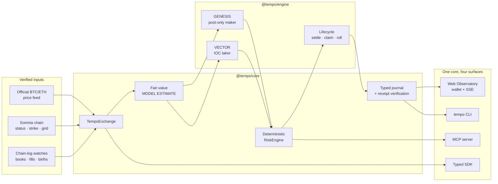

<div align="center">

  

  <h1>TEMPO</h1>

  <h3>The autonomous opening auction for DreamDEX Event Contracts</h3>

  <p><strong>A market is born every minute. TEMPO is already there.</strong></p>

  DreamDEX provides the on-chain CLOB. Somnia provides the real-time execution layer.<br>
  TEMPO supplies the missing market-opening function: <strong>price it, quote it, manage it, settle it, and roll.</strong>

  <br>

  <a href="https://tempo-somnia.vercel.app"><strong>ENTER THE LIVE OBSERVATORY</strong></a>
  &nbsp;&nbsp;·&nbsp;&nbsp;
  <a href="https://youtu.be/YchdanIf05A"><strong>WATCH THE DEMO</strong></a>
  &nbsp;&nbsp;·&nbsp;&nbsp;
  <a href="#proof-not-promises"><strong>VERIFY ON-CHAIN</strong></a>

  <br><br>

  <a href="https://www.typescriptlang.org/"></a>
  <a href="https://somnia.network/"></a>
  <a href="https://dreamdex.io/"></a>
  <a href="test/reports/readme-audit-20260906.md"></a>
  <a href="test/reports/security.md"></a>
  <a href="test/reports/security.md"></a>
  <a href="LICENSE"></a>

</div>

<br>

<div align="center">
  <a href="https://youtu.be/YchdanIf05A">
    
  </a>
  <br>
  <sub>▶ Click the lifecycle to watch TEMPO operate end to end.</sub>
</div>

---

## The 60-second judge brief

| | The answer |
|---|---|
| **Problem** | DreamDEX continuously creates short-lived prediction markets, but each new window begins with an empty order book. In a dated live snapshot, **10 of the latest 12 finalized windows had zero trades**. |
| **Primitive** | **Liquidity Genesis**: an autonomous opening service that derives a fair-value estimate before a book exists, seeds bounded two-sided liquidity, manages the window through expiry, claims settlement, and rolls capital into its successor. |
| **Why Somnia** | Reactive chain-log subscriptions, ~100 ms blocks, sub-second finality, low transaction cost, and one-round-trip SDK writes make continuous on-chain quote management viable. |
| **Why DreamDEX** | Its on-chain opening price, mint-a-pair matching, mandatory order expiry, CLOB, ERC-6909 outcomes, and keeperless settlement are the mechanism—not interchangeable integrations. |
| **Why agents** | Six cadences across BTC and ETH create overlapping markets no human desk can continuously discover, price, risk-check, quote, settle, and roll. GENESIS and VECTOR do it under one deterministic risk boundary. |
| **Proof** | A dated testnet evidence window records **2,381 births, 2,004 real order sends, 1,464 unique transaction hashes, 100 fills, 13 claims, and 1,255.625 tUSDC matched quote notional**. |

> **The insight:** a quoting bot assumes a market already exists. TEMPO provides the missing function that makes a newborn market usable.

## The empty-book problem

Every rolling DreamDEX Event Contract is created with an on-chain opening price and a hard expiry—but no opening liquidity.

```text
Traditional venue   LIST ──▶ OPENING AUCTION ──▶ CONTINUOUS TRADING ──▶ CLOSE
                                market exists

Rolling EC window   BIRTH ──▶      EMPTY BOOK      ──▶ EXPIRY ──▶ ZERO TRADES
                                      ▲
                                      │
                              TEMPO fills this gap
```

The baseline `ec-maker` can quote around an existing midpoint and falls back to `0.50` when the book is empty. That is not price discovery: the number is disconnected from the underlying asset, the window's opening strike, realized volatility, and time remaining.

TEMPO begins one step earlier. Before there is a midpoint, it derives a labeled **MODEL ESTIMATE** from the official price feed and on-chain strike, then turns that estimate into a risk-bounded opening book.

The dead-market observation is reproducible in the [business-impact snapshot](test/reports/business-impact-20260905.md): at `2026-09-05T16:47:03.779Z`, 10 of 12 recently finalized windows reported `tradeCount: 0`. It is a dated testnet observation, not a claim about every market or future mainnet performance.

## The primitive: Liquidity Genesis

TEMPO runs every supported market through one autonomous lifecycle:

```text
BIRTH ─▶ ANCHOR ─▶ GENESIS ─▶ REPRICE ─▶ ENDGAME ─▶ LOCK ─▶ SETTLE ─▶ CLAIM ─▶ ROLL
  │         │          │          │           │         │         │         │       │
detect   estimate   seed book   react to    control   stop new  observe   redeem  successor
window   fair value  two-sided  fills/time  expiry    orders    result    payout  receives capital
```

Four mechanisms make that lifecycle distinct:

1. **The Anchoring** — compute a fair-value estimate from official BTC/ETH spot, the window's on-chain opening price, realized volatility, and time remaining *before an external book exists*.
2. **Liquidity Genesis** — place complementary post-only Up and Down bids. DreamDEX's mint-a-pair path can create the outcome pair when opposite buyers cross, so opening liquidity does not require pre-held outcome-token inventory. Collateral and fill risk remain explicitly capped.
3. **Verifiable Trading Intelligence** — journal the inputs and estimate before action; pair it with the eventual on-chain outcome; score it with a Brier score; calibrate only within operator-defined bounds.
4. **The Roll** — detect resolution or void, redeem the correct outcome side on-chain, then reallocate recovered collateral to a successor window.

### The anchoring model

For spot \(S_t\), on-chain opening strike \(K\), realized volatility per square-root-second \(\sigma\), and seconds to expiry \(\tau\):

$$
p_{\mathrm{up}} = \Phi\!\left(\frac{\ln(S_t/K)}{\sigma\sqrt{\tau}}\right),
\qquad p_{\mathrm{down}} = 1-p_{\mathrm{up}}
$$

This is a driftless diffusion estimate—not an oracle fact. TEMPO labels it `MODEL ESTIMATE`, preserves its inputs, and refuses to quote when the required live data is unavailable.

GENESIS then proposes complementary resting bids around the estimate:

$$
q_{\mathrm{up}}=p_{\mathrm{up}}-\delta,
\qquad
q_{\mathrm{down}}=(1-p_{\mathrm{up}})-\delta
$$

The spread \(\delta\) decays toward expiry and the policy skews against accumulated inventory. Prices and sizes are quantized to the live pool's tick and lot grid before the shared `RiskEngine` can approve them.

## Two agents. Separate capital. One hard risk boundary.

| Agent | Mandate | Execution policy | Independent failure domain |
|---|---|---|---|
| **GENESIS** | Create and maintain the opening book | Post-only maker quotes, cancel/replace, inventory skew, expiry control, claims, roll | Dedicated signer, capital ledger, nonce state, and maker limits |
| **VECTOR** | Challenge mispriced touch liquidity | IOC only when its independent estimate clears a calibrated edge threshold | Dedicated signer, capital ledger, nonce state, and taker limits |

They do not share keys, they cannot self-match through one account, and neither can bypass the common `RiskEngine`. Every proposed write is checked for:

- live on-chain market status (`Trading` must equal `1`);
- tick and lot alignment from the active pool;
- mandatory order expiry no later than market expiry;
- per-order collateral, inventory, open-order, capital, loss, and time-left caps;
- signer availability and emergency pause state;
- successful transaction receipt after broadcast.

GENESIS and VECTOR are autonomous policies, not conversational personas. Hot-path decisions remain deterministic and inspectable; optional LLM narration is isolated to the cold reporting path.

## Why this can only work here

### Somnia is load-bearing

| Somnia capability | What TEMPO does with it | Why it matters |
|---|---|---|
| **~100 ms blocks and sub-second finality** | Manages short-lived books through repeated on-chain state transitions | A 60-second market still spans hundreds of blocks |
| **`somnia_watch` off-chain reactivity** | Receives chain events with same-block read results and maintains live books | Avoids a timer-only quoting loop and reduces read-after-event races |
| **`realtime_sendRawTransaction` via the SDK** | Submits and confirms supported writes in one round trip | Shrinks pending-state uncertainty for cancel/replace and IOC execution |
| **Low transaction cost** | Services overlapping BTC/ETH windows across six cadences | Makes frequent on-chain quote maintenance economically plausible |
| **On-chain reactivity** | DreamDEX delivers oracle resolution to event markets without an external keeper | Gives TEMPO a native settlement and claim rail |

Remove Somnia and the reaction speed, cost model, and settlement architecture stop supporting the product.

### DreamDEX is the mechanism

| DreamDEX primitive | TEMPO use |
|---|---|
| On-chain opening price | Non-circular strike anchor for each estimate |
| Fully on-chain CLOB | Verifiable resting orders, fills, cancels, and book state |
| Mint-a-pair matching | Complementary two-sided bids without pre-held outcome inventory |
| Mandatory order expiry | Protocol-level dead-man's switch for stale autonomous quotes |
| ERC-6909 Up/Down outcomes | Explicit inventory and settlement accounting |
| Oracle-scheduled resolution | Public winning outcome and void-aware redemption path |
| Zero venue trading/settlement fees | Preserves the economics of small, frequent event windows |

Remove Event Contracts and there is no birth to attend, strike to anchor, expiry to manage, settlement to claim, or successor to roll into.

## Proof, not promises

All economic figures below come from the typed journal, chain receipts, or deterministic aggregation over those records. The headline snapshot is dated so historical evidence is never presented as a live counter.

### Operating record

| Verified metric | Observed value | Evidence |
|---|---:|---|
| Market births journaled | **2,381** | [Business-impact snapshot](test/reports/business-impact-20260905.md) |
| Agent decisions journaled | **8,805** | [Business-impact snapshot](test/reports/business-impact-20260905.md) |
| Real order sends | **2,004** | [Business-impact snapshot](test/reports/business-impact-20260905.md) |
| Unique transaction hashes | **1,464** | [Business-impact snapshot](test/reports/business-impact-20260905.md) |
| On-chain fills observed | **100** | [Business-impact snapshot](test/reports/business-impact-20260905.md) |
| Matched quote notional | **1,255.625 tUSDC** | [Business-impact snapshot](test/reports/business-impact-20260905.md) |
| Settlement claims | **13** | [Business-impact snapshot](test/reports/business-impact-20260905.md) |
| Funded receipt verification | **31/31 successful** | [Receipt replay](test/reports/verify-20260902.md) |
| Current automated suite | **2,118/2,118 passing** | [Current verification](test/reports/readme-audit-20260906.md) |
| Economic invariant matrix | **2,048 cases** across 6- and 18-decimal collateral | [Offline report](test/reports/offline-20260903.md) |

Snapshot window: `2026-09-02T05:10:23.810Z` through `2026-09-05T16:51:04.237Z`, Somnia Shannon testnet, chain ID `50312`.

### Measured intelligence

TEMPO does not ask judges to accept “AI-powered” as evidence. It grades its own pre-expiry estimates against settled outcomes.

| Calibration metric | Result | Meaning |
|---|---:|---|
| Scored non-void markets | **18** | Estimates paired with final on-chain outcomes |
| Brier score | **0.0561** | `0` is perfect; `0.25` is coin-flip confidence |
| Directional accuracy | **94.4% (17/18)** | Correct side of 50% in the dated sample |

The sample is promising but small and testnet-specific. It demonstrates a working closed measurement loop, not guaranteed future performance. Full derivation: [calibration report](test/reports/calibration.md).

### Full lifecycle receipts

One recorded BTC window completed discovery → quoting → real fill → settlement → claim → roll. Every listed receipt returned `success` on Shannon testnet.

| Lifecycle action | Agent | Block | Transaction |
|---|---|---:|---|
| Fund GENESIS with test collateral | GENESIS | 477740388 | [`0x7a78a4…`](https://shannon-explorer.somnia.network/tx/0x7a78a4f4ca13cc59c94ee6d1a78c03bead20112ef71ae1adcd1f3850b4f6561a) |
| Fund VECTOR with test collateral | VECTOR | 477740400 | [`0xb51c35…`](https://shannon-explorer.somnia.network/tx/0xb51c35c96f3bcd8b061c4f956b946d2177d1276f7ca1c9849ee16aeb160375b1) |
| Mint complete outcome set | GENESIS | 477740614 | [`0xe4cfac…`](https://shannon-explorer.somnia.network/tx/0xe4cfacbcccf7100a16bdec6d91b77b7a36d1137125cd6f072115b05c14c31710) |
| Place post-only anchor quote | GENESIS | 477740795 | [`0x61df88…`](https://shannon-explorer.somnia.network/tx/0x61df8841b3fe0b505415ce28f983c888f24c8bce712d32003cdce6416af9e0b7) |
| Cancel stale quote | GENESIS | 477740941 | [`0xec1a64…`](https://shannon-explorer.somnia.network/tx/0xec1a645007bc031ddf1ea16e5d21b1bdf6291f634dee9c03955c37f1506028ed) |
| Execute IOC take and fill | VECTOR | 477741474 | [`0x3d2cc4…`](https://shannon-explorer.somnia.network/tx/0x3d2cc41de74db30eb8811609cdee105e9657a7dce2b463236b3a5618a6b26079) |
| Redeem settlement | GENESIS | 477940746 | [`0xd9aad1…`](https://shannon-explorer.somnia.network/tx/0xd9aad1477ac2e99a8ec4281b5c447ca9b5c3d625600eb59ae9a938889bf2ac5e) |

The complete ledger, timestamps, market ID, and remaining quote receipts are in [full on-chain mode evidence](test/reports/full-onchain-mode.md). Run `tempo verify` to replay journal hashes against the configured RPC.

## Architecture



The system deliberately separates truth, estimates, policy, and narration:

| Layer | Role | Trust model |
|---|---|---|
| **Chain and feed facts** | Opening price, status, grid, spot, balances, fills, settlement | Provenance-linked external facts |
| **Deterministic hot path** | Diffusion estimate, quote policy, risk checks, calibration | Pure TypeScript math with recorded inputs and tests |
| **Autonomous execution** | Discover, quote, cancel, take, claim, roll | Separate signers; every write chain-gated and receipt-checked |
| **Cold LLM path** | Optional `tempo report --llm` narrative synthesis | Labeled `AI NARRATIVE`; never allowed to sign or alter hot-path policy |
| **MCP interoperability** | Structured live reads and an optional governed order request | Writes disabled by default and still routed through the same risk boundary |

### SDK and ecosystem utilization

TEMPO uses the Somnia and DreamDEX ecosystem as operating infrastructure, not as a decorative integration:

- **`@somnia-chain/markets-sdk` unified tier:** live market discovery, CLOB books, POST_ONLY and IOC order construction, mint/burn complete sets, cancellation, fills, candles, and user activity.
- **Markets SDK client tier:** bigint-exact on-chain status, opening prices, pool grids, balances, resolution, finalized markets, and settlement reads used to gate every write and verify every lifecycle step.
- **Markets SDK trader tier:** explicit on-chain redemption and faucet operations where the higher-level tiers do not model the required write.
- **Markets SDK live watches:** birth discovery, materialized books, fills, user orders, and chain-log-driven updates for the engine and Observatory.
- **`@somnia-chain/reactivity`:** Somnia’s `somnia_watch` subscriptions with same-block reads for fill/book reactions and appraiser updates.
- **Somnia native RPC and SDK writes:** `realtime_sendRawTransaction`, Somnia chain definitions, exported ABIs, and native transaction behavior for fast, receipt-checked writes.
- **DreamDEX Event Contract resources:** on-chain CLOB, mint-a-pair matching, ERC-6909 outcomes, pool tick/lot parameters, mandatory expiry, oracle resolution, and permissionless redemption.
- **DreamDEX Bot Kit resources:** documented guards for status gating, tick/lot quantization, wallet reconciliation, expiry dead-man switches, claim sweeps, and maker-edge measurement; TEMPO applies those patterns to the Event Contract surface.
- **Somnia ecosystem resources:** official BTC/ETH price feed, oracle settlement references, Shannon RPC/WebSocket endpoints, and published contract ABIs and deployment addresses.

The result is one typed core shared by the engine, CLI, SDK, MCP, and Observatory, with facts sourced from chain/feed infrastructure and decisions preserved in an auditable journal.

## Product surfaces

### Live Observatory

The [public Observatory](https://tempo-somnia.vercel.app) is a responsive, multipage operating console backed by the deployed TEMPO engine. It exposes active windows, on-chain strike and status, materialized books, labeled fair-value estimates, agent state, journal activity, settlement audit links, and pre-sign wallet review.

- Frontend: [tempo-somnia.vercel.app](https://tempo-somnia.vercel.app)
- Production API: [health](https://20-189-112-129.sslip.io/health)
- Pages: Dashboard · Markets · History · Docs · Protocol
- Browser trading: EIP-6963/EIP-1193 discovery, chain gating, allowlisted destinations, explicit pre-sign summary, and wallet-owned signing

The operator keys never enter the browser. Missing or unavailable upstream data stays `UNAVAILABLE`, `PENDING`, or `NO DATA`.

### Wallet and Observatory UX

The browser is a non-custodial participant surface: operator keys never enter it, and user orders are signed only by the connected wallet after a live chain-gated review. The recent wallet-flow correction makes **Review IOC** a first-class UX component: it rebuilds the order against the current market, checks allowance and estimated network fee, rejects an IOC with no available fill, presents destinations, expiry, cost, collateral, chain, and RiskEngine status, then revalidates account and network immediately before signing. Approval receipts are confirmed before the order is rebuilt and reviewed again; no success state is shown before an on-chain receipt succeeds.

Other user-facing components include EIP-6963 wallet discovery with a detected-wallet picker, wrong-network detection and one-click chain switching, connected-wallet activity, live market and book views, evidence-linked transaction and settlement panels, onboarding guidance, responsive navigation, command search, theme selection, and reduced-motion support. These are designed to make a live on-chain system inspectable and usable without hiding the underlying facts.

### CLI

Seventeen top-level commands cover inspection, operation, evidence, and settlement:

```text
doctor       markets      book          watch         agents       positions
firm         trade        claims        settlements   activity     verify
backtest     report       calibrate     mcp           faucet
```

Use `npm run cli -- --help` for the canonical surface. High-value paths:

```bash
npm run cli -- doctor                 # bounded read-only dependency probe
npm run cli -- markets                # discover current rolling windows
npm run cli -- book BTC               # inspect book, strike, grid, and estimate
npm run cli -- verify                 # replay journal receipts against Somnia
npm run cli -- report --llm           # optional cold-path narrative report
```

### Typed SDK

The repository contains `@tempo/core` v0.3.1. The latest packaged GitHub artifact is v0.3.0:

```bash
npm install https://github.com/Kevincruz2005/Tempo/releases/download/sdk-v0.3.0/tempo-core-0.3.0.tgz
```

```ts
import {
  TempoExchange,
  fairValue,
  loadConfig,
  realizedVolPerSqrtSec,
} from "@tempo/core";

const exchange = new TempoExchange({ config: loadConfig() });

try {
  const market = (await exchange.markets())[0];
  if (!market) throw new Error("NO DATA");

  const [chain, spot, history] = await Promise.all([
    exchange.onchain(market.marketId),
    exchange.spot(market.asset),
    exchange.spotHistory(market.asset, { limit: 60 }),
  ]);
  if (chain.status !== 1 || !spot) throw new Error("NO DATA");

  const strike = await exchange.openingPrice(market.marketId, spot.price);
  const sigmaPerSqrtSec = realizedVolPerSqrtSec(history);
  if (strike === undefined || !Number.isFinite(sigmaPerSqrtSec)) {
    throw new Error("NO DATA");
  }

  const estimate = fairValue({
    spot: spot.price,
    strike,
    sigmaPerSqrtSec,
    secondsLeft: Math.max(0, market.expiry - Date.now() / 1_000),
  });

  console.log({ market: market.symbol, estimate }); // MODEL ESTIMATE
} finally {
  await exchange.close();
}
```

### MCP server

The MCP server exposes ten live read tools and one governed write tool:

| Live reads | Governed write |
|---|---|---|
| `discover_markets` · `inspect_event_contract` · `get_live_book` · `get_market_state` · `get_fair_value` · `get_risk_state` · `get_positions` · `get_settlement` · `get_activity` · `verify_receipt` | `place_order` |

`place_order` is absent unless TEMPO_MCP_WRITES=true and a signer is configured. If enabled, it is a real IOC write that still passes through live on-chain status checks, quantization, the RiskEngine, journaling, and receipt validation.

### Operational truth boundaries

All economic state, market data, orders, fills, settlements, balances, and transaction receipts referenced by TEMPO come from the live chain, official feeds, or receipt-backed journal records. Browser wallet actions are prepared against current chain state, signed by the user’s wallet, and accepted only after a successful on-chain receipt. No economic value is invented or substituted.

## Run it in under two minutes

### Requirements

- Node.js 20 or newer
- npm 10 or newer
- Git

### Safe local launch

```bash
git clone https://github.com/Kevincruz2005/Tempo.git
cd Tempo
npm install
cp .env.example .env
npm test
npm run firm
```

Open `http://127.0.0.1:7333`. The default launch is read-only for operator safety: it connects to live dependencies, renders live state, and keeps signing authority out of the browser.

### Live testnet execution

Live writes require two separately funded Shannon testnet accounts. Keep private keys only in the local `.env`, fund both with testnet STT for gas, then:

```bash
npm run faucet                         # mint testnet tUSDC to configured agents
# set TEMPO_DRY_RUN=false in .env
npm run cli -- firm start              # begin risk-gated testnet execution
npm run cli -- verify                  # independently replay resulting receipts
```

Safety defaults:

```dotenv
TEMPO_NETWORK=testnet
TEMPO_DRY_RUN=true
TEMPO_PAUSED=false
TEMPO_MCP_WRITES=false
```

The full configuration surface and bounded risk defaults live in [`.env.example`](.env.example). Production operations are documented in [the security runbook](docs/SECURITY.md) and [design document](docs/DESIGN.md).

## Failure is part of the product

An autonomous firm is defined as much by what it refuses and survives as by what it executes.

| Failure mode | Enforced response |
|---|---|
| Indexer reports a stale trading window | Re-read on-chain status; reject the write unless status is `Trading` |
| `PostOnlyWouldCross` | Treat as market movement; refresh inputs and re-quote |
| Price history or feed unavailable | Emit `NO DATA`; do not invent volatility or price |
| WebSocket interruption | Reconnect with backoff and rehydrate from a bounded snapshot path |
| Inventory or capital cap reached | Block the offending side before signing |
| Market resolves void | Redeem both outcomes at the protocol's 0.5 void payout |
| Process dies with resting orders | Mandatory order expiry ages quotes off the book |
| Transaction does not confirm | Record failure; resynchronize nonce and state before retrying |

During a dated live reporting window, TEMPO recorded 996 handled operational errors while the firm process remained available. See the [firm report](test/reports/firm-report-20260902.md); this is resilience evidence, not a claim that every upstream failure is harmless.

## Security and truth boundaries

TEMPO's credibility depends on keeping facts, estimates, and claims separate.

- **100% on-chain economic state:** production prices, balances, fills, receipts, and settlements come from live sources; derived values preserve provenance and successful writes are receipt-checked.
- **No key, no write:** read-only operation remains useful without private keys.
- **Separate agent keys:** GENESIS and VECTOR do not share signer or nonce state.
- **Chain-gated writes:** the live contract status is re-read before every state-changing action.
- **Receipt honesty:** a submitted transaction is not called successful until its receipt succeeds.
- **Application append-only journal:** the runtime appends typed events and never silently rewrites them; `tempo verify` cross-checks transaction-bearing records against the chain.
- **Secret boundaries:** recursive redaction, local-only default binding, CSP, origin/host checks, request bounds, and no browser access to agent credentials.
- **Emergency stop:** `TEMPO_PAUSED=true` blocks engine, CLI, claim, and MCP writes.

Current release-gate evidence: [security](test/reports/security.md) · [wallet](test/reports/wallet-flow.md) · [receipt and truth-boundary evidence](test/reports/security.md).

### How to read the business impact

The dated evidence already shows product impact without inventing fee revenue: 10 of 12 recently finalized windows were empty in the baseline snapshot, while TEMPO recorded 2,381 births, 2,004 real order sends, 100 fills, 1,255.625 tUSDC matched quote notional, and point-in-time two-sided managed-book coverage of 60% of all active windows and 75% of managed active windows. DreamDEX’s current Event Contract fee schedule is 0%, so the honest value signal is usable opening liquidity and matched activity—not protocol-fee revenue.

The strongest next business evidence is independently attributable external flow. New records now preserve maker, taker, counterparty, and FIRM/EXTERNAL classification. A future evidence release will compare managed and unmanaged windows across the same cadences, publish external-fill conversion and repeat-trader measures, and report spread capture or venue maker incentives only when independently verified. This turns the current infrastructure impact into a clearer adoption and sustainability score without overstating the testnet sample.

## What is structurally different

| Capability | Baseline `ec-maker` | TEMPO |
|---|---|---|
| Empty-book price | Fixed `0.50` fallback | Official spot vs on-chain strike, realized volatility, time |
| Trigger | 10-second polling loop | Chain-log watches with bounded fallback paths |
| Opening function | Requires an existing midpoint | Seeds a bounded book before external liquidity exists |
| Inventory model | Mints inventory to sell | Complementary bids can use mint-a-pair without pre-held outcomes |
| Endgame | No full lifecycle policy | Spread decay, certainty skew, lock discipline |
| Settlement | Claim sweep | Resolution observation, void-aware claim, capital roll |
| Learning | None | Brier-scored, bounded calibration epochs |
| Evidence | Console output | Typed decision journal plus on-chain receipt replay |
| Interfaces | Strategy process | Observatory, wallet, CLI, SDK, MCP, HTTP/SSE |

TEMPO is not “a bot with a dashboard.” The reusable asset is the complete operating system for ephemeral market liquidity: discovery, estimation, risk, execution, observability, settlement, and roll.

## Hackathon impact

| Judging dimension | What TEMPO demonstrates |
|---|---|
| **Innovation** | A named market-structure primitive—Liquidity Genesis—rather than another directional strategy layered over an existing book |
| **Technical implementation** | Deep use of all three DreamDEX SDK tiers, live watches, Somnia-native RPC behavior, on-chain gating, settlement, separate agents, and four product surfaces |
| **User experience** | Public responsive Observatory, evidence-linked state, honest unavailable states, and non-custodial pre-sign wallet review |
| **Business and ecosystem impact** | Turns empty rolling windows into usable trading surfaces; measured matched activity without inventing protocol-fee revenue |
| **Presentation and proof** | Live deployment, short demo, dated metrics, direct explorer receipts, reproducible test suite, and one-command journal verification |

### Sustainable path and next evidence

- GENESIS targets spread capture, settlement value, and venue maker incentives where applicable.
- VECTOR targets bounded edge when its independent estimate disagrees with the touch.
- Somnia's execution cost and a single autonomous runtime keep continuous coverage operationally lean.
- The MIT-licensed SDK and MCP surface let other builders add assets, policies, and agent consumers.
- The next distribution layer is a public anchor feed through Somnia Data Streams, turning genesis estimates into reusable market infrastructure.
- The next impact milestone is independently verified external flow and matched managed-versus-unmanaged coverage, followed by transparent spread and incentive accounting.

Historical records do not contain sufficient counterparty attribution to claim external user adoption. New fills now record maker, taker, counterparty, and `FIRM`/`EXTERNAL` classification; TEMPO will make that claim only after independently verifiable evidence exists.

## Known limitations

- The operating evidence is from Shannon testnet, not mainnet, and testnet liquidity is thin.
- The Brier result contains 18 scored markets; it validates the measurement loop but is not a large performance study.
- Official feed availability remains a hard dependency. TEMPO halts estimation-dependent quoting when the feed cannot provide enough history.
- Indexer head lag occurs; direct chain reads and write-time status gates mitigate it but do not make upstream services infallible.
- Browser wallet execution still requires explicit confirmation for every transaction; operator-scoped session keys are roadmap work.
- Historical fill attribution cannot prove external adoption.

## Evidence room

| Question a judge might ask | Direct answer |
|---|---|
| Did the full lifecycle execute? | [Full on-chain lifecycle](test/reports/full-onchain-mode.md) |
| Are the transaction hashes real? | [Receipt verification tape](test/reports/verify-20260902.md) |
| Where did the headline metrics come from? | [Business-impact snapshot](test/reports/business-impact-20260905.md) |
| Does the model grade itself? | [Calibration report](test/reports/calibration.md) |
| Is economic state live? | [Security and truth-boundary evidence](test/reports/security.md) |
| Are writes and keys bounded? | [Security gate](test/reports/security.md) · [security runbook](docs/SECURITY.md) |
| Does every CLI path work? | [CLI live matrix](test/reports/cli-live.md) |
| Does MCP work against live dependencies? | [MCP live report](test/reports/mcp-live.md) |
| Is the wallet flow tested? | [Wallet evidence](test/reports/wallet-flow.md) |
| Can I inspect the system design? | [Design document](docs/DESIGN.md) · [ecosystem reconnaissance](docs/RECONNAISSANCE.md) |
| Can I reproduce the current build? | [Current verification report](test/reports/readme-audit-20260906.md) |

---

<div align="center">

  <h3>DreamDEX built the venue. Somnia made it real-time. TEMPO makes it liquid at the open.</h3>

  <p><strong>The machine does not ask to be trusted—it leaves evidence.</strong></p>

  <a href="https://tempo-somnia.vercel.app"><strong>Open Observatory</strong></a>
  &nbsp;·&nbsp;
  <a href="https://youtu.be/YchdanIf05A"><strong>Watch Demo</strong></a>
  &nbsp;·&nbsp;
  <a href="docs/DESIGN.md"><strong>Read Design</strong></a>
  &nbsp;·&nbsp;
  <a href="test/reports/"><strong>Inspect Evidence</strong></a>

  <br><br>

  MIT © TEMPO

</div>
