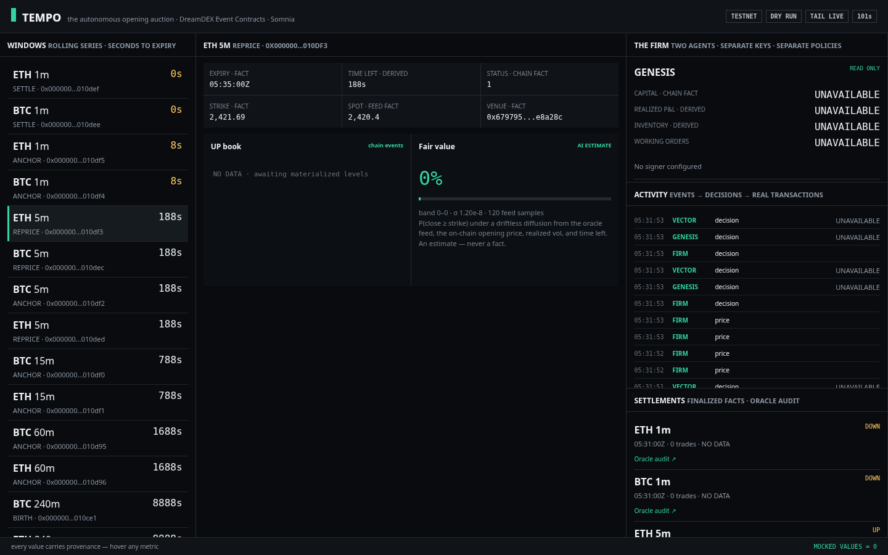
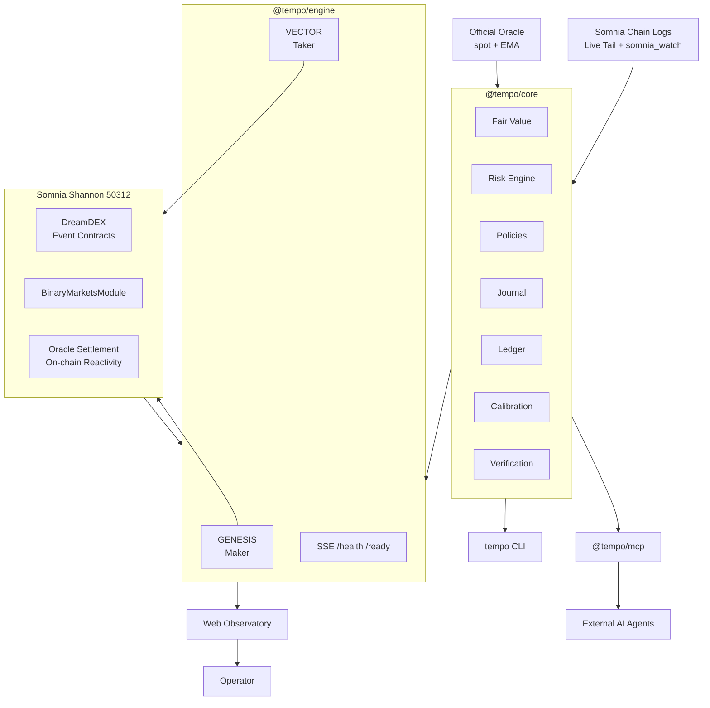
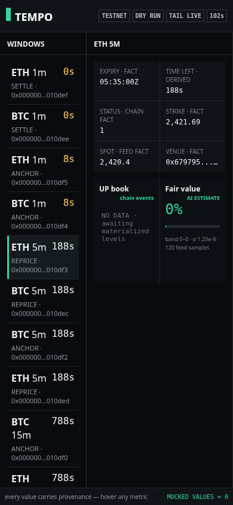

<div align="center">

# ⚡ TEMPO

### **The Autonomous Opening Auction for DreamDEX Event Contracts**

**Every Event Contract is born with an empty book.
TEMPO gives it a market.**

<br/>



<br/><br/>


<br/><br/>

<a href="https://github.com/Kevincruz2005/Tempo">🐙 Repository</a>
 •  <a href="#-on-chain-proof">📜 On-Chain Proof</a>
 •  <a href="SUBMISSION.md">📋 Submission</a>
 •  <a href="docs/DESIGN.md">📐 Architecture</a>

</div>

---

# 🎯 What is TEMPO?

**TEMPO is an autonomous market-making firm built specifically for DreamDEX Event Contracts on Somnia.**

DreamDEX continuously creates short-lived prediction markets. Every new market starts with an **empty order book**.

That creates the core problem:

> **Who provides the first credible price?**

TEMPO acts as the market's **opening auction**.

At the birth of each Event Contract, TEMPO:

**discovers → values → anchors → quotes → reprices → manages risk → settles → claims → rolls**

The result is a stream of ephemeral prediction markets that behaves like **one continuously attended market**.

### The thesis

> **Don't wait for liquidity to appear.
> Make liquidity appear at birth.**

---

# ⚡ Why TEMPO Exists

DreamDEX can create BTC/ETH Up/Down Event Contracts with lifetimes ranging from **60 seconds to 24 hours**.

Every window has:

* an empty order book at birth
* an on-chain opening price
* a fixed expiry
* an on-chain settlement lifecycle

The problem is especially severe for very short-lived markets.

A human cannot economically sit in front of hundreds of markets that may live for only seconds or minutes.

And quoting the midpoint of an already-existing book does not solve the **birth problem**.

TEMPO does.

### TEMPO provides the missing first price.

Instead of waiting for traders to create liquidity:

**TEMPO becomes the first liquidity provider.**

---

# 🧠 The TEMPO Loop

```text
                         ┌──────────────────────┐
                         │     EVENT BORN       │
                         └──────────┬───────────┘
                                    ↓
                         ┌──────────────────────┐
                         │       DISCOVER       │
                         │  chain-log live tail │
                         └──────────┬───────────┘
                                    ↓
                         ┌──────────────────────┐
                         │        ANCHOR        │
                         │ fair value + opening │
                         │       price          │
                         └──────────┬───────────┘
                                    ↓
                         ┌──────────────────────┐
                         │       GENESIS        │
                         │  two-sided liquidity │
                         │    zero inventory    │
                         └──────────┬───────────┘
                                    ↓
                    ┌───────────────────────────────┐
                    │            REPRICE            │
                    │ fills · price · time · risk  │
                    └───────────────┬───────────────┘
                                    ↓
                         ┌──────────────────────┐
                         │       ENDGAME        │
                         │ tighten + skew quotes│
                         └──────────┬───────────┘
                                    ↓
                         ┌──────────────────────┐
                         │       SETTLE         │
                         │    on-chain oracle   │
                         └──────────┬───────────┘
                                    ↓
                         ┌──────────────────────┐
                         │        CLAIM         │
                         │    redeem winnings   │
                         └──────────┬───────────┘
                                    ↓
                         ┌──────────────────────┐
                         │         ROLL         │
                         │   next window →      │
                         │       BIRTH          │
                         └──────────────────────┘
```

**No human. No keeper. No cron-driven trading loop.**

---

# 📊 Live Firm Statistics

> **Source:** journal-derived live operation on Somnia Shannon testnet, 24-hour window on 2026-09-02.
> Nothing simulated or projected in these figures.

| Metric                               |                Live Result |
| ------------------------------------ | -------------------------: |
| **Event Contract windows observed**  |                    **369** |
| BTC / ETH windows                    |              **192 / 177** |
| Agent decisions journaled            |                  **6,274** |
| Real orders sent                     |                    **168** |
| Unique transaction hashes            |                    **120** |
| On-chain fills / settlements claimed |                 **10 / 3** |
| Transaction verification             |   **31 / 31 — 0 failures** |
| Brier score                          |                 **0.0723** |
| Directional accuracy                 | **100% on scored markets** |
| Indexer timeouts absorbed            |                    **996** |
| Firm crashes                         |                      **0** |
| Automated tests                      |          **2,107 passing** |
| `npm audit` vulnerabilities          |                      **0** |
| Mocked economic values               |                      **0** |

**The machine trades. The journal remembers. The chain proves.**

---

# 🟣 Why Somnia?

Somnia isn't simply where TEMPO is deployed.

**Somnia is part of why TEMPO works.**

### ~100 ms blocks

TEMPO continuously reprices live markets.

At this frequency, low latency and inexpensive transactions turn continuous quoting into an economically viable mechanism.

### `somnia_watch`

TEMPO consumes live chain activity rather than relying on a slow polling loop.

Book and fill events arrive with same-block read context, allowing the firm to react in the block era.

### One-round-trip writes

`realtime_sendRawTransaction` provides send + receipt confirmation in a single round trip.

### On-chain reactivity

DreamDEX settlement can progress through Somnia's on-chain reactivity.

**No external keeper.
No cron job.
No centralized settlement worker.**

---

# 🟠 Why DreamDEX Event Contracts?

DreamDEX provides several primitives that make autonomous market making possible.

### 1. On-chain opening price

The opening price becomes an important reference point for TEMPO's fair-value model.

### 2. Mint-a-pair

TEMPO can create two-sided liquidity with **zero initial directional inventory**.

### 3. Mandatory order expiry

Orders cannot outlive their Event Contract window.

This gives autonomous agents a built-in safety boundary.

### 4. `Finalized` lifecycle

The market lifecycle provides the path from:

**trading → settlement → redemption → successor window**

> Remove DreamDEX or Somnia's low-latency primitives, and TEMPO's mechanism loses its foundation.

---

# 🤖 The Agent Firm

TEMPO is not one monolithic trading bot.

It is a small autonomous firm containing **independent policies**.

| Agent       | Function                | Behavior                                                                                       |
| ----------- | ----------------------- | ---------------------------------------------------------------------------------------------- |
| **GENESIS** | Liquidity Genesis Maker | Anchors newborn markets, provides two-sided liquidity, reprices, manages inventory and endgame |
| **VECTOR**  | Adversarial Taker       | Independently estimates fair value and takes IOC liquidity when sufficient edge exists         |

Both agents operate over the same live market information.

But they have **different policies, different keys and different capital**.

That means disagreement isn't simulated.

### It is actual trading.

---

# 🛡️ Risk Engine

Every order passes through the same deterministic `RiskEngine` **before signing**.

Risk controls include:

* per-window inventory caps
* per-order collateral limits
* firm-wide capital limits
* tick / lot grid alignment
* expiry headroom
* mandatory order expiry
* signing gates
* dry-run protection

During the recorded 24-hour operation, the risk engine **rejected an order that would have exceeded the inventory limit**.

The boundary worked.

And the decision was journaled.

---

# 🧠 Verifiable Machine Intelligence

TEMPO deliberately avoids the phrase:

> “Trust our AI.”

Instead:

> **Verify the evidence.**

Every estimate is recorded before the corresponding action.

### Journaled intelligence

Each estimate can include:

```text
spot
strike
volatility
time-to-expiry
computed probability
policy decision
risk decision
```

Records are explicitly classified as:

```text
AI ESTIMATE
CHAIN FACT
POLICY
DERIVED
```

This creates a provenance trail from **input → decision → transaction → outcome**.

---

# 📈 The Firm Grades Itself

Resolved markets are used to evaluate the appraiser's final pre-expiry estimate.

Current recorded results:

### **Brier Score: 0.0723**

Where:

```text
0.00 = perfect
0.25 = coin-flip baseline
```

### **Directional Accuracy: 100%**

on the currently scored markets.

TEMPO also contains a deterministic calibration loop.

It can adjust exactly two pricing parameters:

* volatility multiplier
* taker edge

Adjustments are:

* bounded to **0.5×–2×**
* performed only after ≥25-market epochs
* journaled with their reason

### Autonomous.

### Bounded.

### Auditable.

---

# 🏗️ Architecture



### One core. Three surfaces.

```text
             ┌─────────────────┐
             │   @tempo/core   │
             │                 │
             │ fair value      │
             │ risk            │
             │ journal         │
             │ ledger          │
             │ calibration     │
             │ verification    │
             └────────┬────────┘
                      │
        ┌─────────────┼─────────────┐
        ↓             ↓             ↓
      CLI           MCP        Observatory
```

**Trading logic is not duplicated across interfaces.**

---

# 🔐 Zero-Mock Architecture

TEMPO follows one rule:

> **If the system doesn't know something, it says so.**

Displayed information carries provenance:

```text
price-feed
on-chain
policy
derived
```

Unavailable information is represented honestly:

```text
UNAVAILABLE
NO DATA
PENDING
```

There are **0 mocked economic values** in the recorded system.

This is especially important for a trading system:

**fake data can make a demo look perfect.**

TEMPO chooses evidence instead.

---

# 📜 On-Chain Proof

All transactions below were executed on **Somnia Shannon testnet** and independently checked using:

```bash
tempo verify
```

Recorded verification:

### **31 / 31 hashes verified**

### **0 failures**

### Example market lifecycle

Market:

```text
0x…010fad
```

Date:

```text
2026-09-02
```

| Lifecycle step            | Agent      | Transaction     |
| ------------------------- | ---------- | --------------- |
| Testnet collateral minted | GENESIS    | `0x7a78a4…`     |
| Testnet collateral minted | VECTOR     | `0xb51c35…`     |
| Complete set minted       | GENESIS    | `0xe4cfac…`     |
| Anchor quote resting      | GENESIS    | `0x61df88…`     |
| Stale quote cancelled     | GENESIS    | `0xec1a64…`     |
| Inventory-side sell       | GENESIS    | `0x55343b…`     |
| **IOC take — real fill**  | **VECTOR** | **`0x3d2cc4…`** |

Full lifecycle evidence:

```text
test/reports/full-onchain-mode.md
```

The repository also includes contract addresses, block numbers and timestamps for independent verification.

---

# 🧰 Developer Surface

TEMPO isn't only a trading application.

It exposes the firm as infrastructure.

## `tempo` CLI

```bash
tempo doctor
tempo markets
tempo book <frag>
tempo watch

tempo agents
tempo positions

tempo firm simulate
tempo firm start

tempo trade <frag> <up|down> <qty>

tempo claims
tempo settlements
tempo activity

tempo verify
tempo report
tempo calibrate
```

### Dry-run first.

```bash
tempo firm simulate
```

runs the firm while sending nothing on-chain.

Live trading requires explicit configuration and funded keys.

---

# 📦 `@tempo/core`

A typed Node SDK containing the core trading infrastructure:

```text
fair-value engine
risk engine
policies
journal
ledger
calibration
verification
exchange wrapper
```

The exchange layer integrates across the three available:

```text
@somnia-chain/markets-sdk
```

tiers:

```text
unified
client
trader
```

Release artifacts include:

* CycloneDX SBOM
* SHA256 checksums
* strict TypeScript
* clean-environment consumer verification

Current version:

```text
@tempo/core v0.2.0
```

---

# 🧩 `@tempo/mcp`

TEMPO exposes **12 MCP tools** for external AI agents.

### Read capabilities include:

```text
discover_markets
inspect_event_contract
get_live_book
get_fair_value
get_settlement
verify_receipt
...
```

Trading is intentionally constrained.

```text
simulate_trade
```

is always dry-run.

Actual writes require:

```text
TEMPO_MCP_WRITES=true
```

and still pass through the same `RiskEngine`.

### External agents get access to TEMPO's capabilities.

### They do not get access to its private keys.

---

# 👁️ Web Observatory

A single-screen operational view for the entire firm.

It exposes:

* live Event Contract windows
* materialized order books
* fair-value bands
* firm roster
* agent activity
* real transaction hashes
* settlement activity
* oracle audit links
* SSE live stream
* wallet connection
* `/health`
* `/ready`

The goal is simple:

> **Watch the firm trade. Then verify what it did.**

<div align="center">

</div>

---

# 📂 Repository

```text
TEMPO/
│
├── packages/
│   ├── core/
│   │   └── @tempo/core
│   │       ├── fair value
│   │       ├── risk
│   │       ├── policies
│   │       ├── journal
│   │       ├── ledger
│   │       ├── calibration
│   │       └── exchange
│   │
│   ├── engine/
│   │   └── @tempo/engine
│   │       ├── GENESIS
│   │       ├── VECTOR
│   │       ├── SSE
│   │       └── wallet preparation
│   │
│   ├── cli/
│   │   └── tempo CLI
│   │
│   ├── mcp/
│   │   └── @tempo/mcp
│   │
│   └── web/
│       └── public observatory
│
├── test/
│   ├── unit
│   ├── sdk
│   ├── integration
│   ├── contract
│   ├── e2e
│   ├── failure
│   ├── security
│   ├── economic
│   ├── cli
│   └── reports
│
├── docs/
│   ├── DESIGN
│   ├── RECONNAISSANCE
│   ├── SECURITY
│   └── research corpus
│
├── release/
│   ├── SDK tarballs
│   ├── SBOMs
│   └── SHA256SUMS
│
├── probe/
├── SUBMISSION.md
└── originality_package.md
```

---

# 🚀 Run TEMPO

## Requirements

```text
Node.js >= 20
```

No private keys are required for read-only or dry-run operation.

### Install

```bash
git clone https://github.com/Kevincruz2005/Tempo.git
cd Tempo

npm install
cp .env.example .env
```

### Test

```bash
npm test
```

Current suite:

```text
2,107 tests passing
```

### Start the dry-run firm

```bash
npm run firm
```

Then open:

```text
http://localhost:7333
```

---

# 🔥 Run on Somnia Shannon

For live testnet operation:

```bash
# Configure:
TEMPO_KEY_MAKER
TEMPO_KEY_TAKER

# Mint testnet collateral
npm run faucet

# Disable dry-run explicitly
TEMPO_DRY_RUN=false

# Start the firm
npx tsx packages/cli/src/index.ts firm start

# Verify every recorded transaction
npx tsx packages/cli/src/index.ts verify
```

### Safety defaults

TEMPO:

* defaults to dry-run
* refuses to sign without configured keys
* applies the `RiskEngine` to every order
* enforces mandatory order expiry
* keeps MCP writes opt-in

Trading surfaces do not bypass the core safety layer.

---

# 🗺️ Roadmap

### 📡 Public Anchor Infrastructure

Publish genesis-anchor decisions through Somnia Data Streams so other agents can consume auditable market-opening intelligence.

### 🔑 Operator-Scoped Trading

Integrate DreamDEX's session-key model for controlled browser-based interaction with anchored markets.

### 🤖 Specialized Agents

Extend the firm with:

* hedger
* laddered endgame quoter
* additional bounded strategies

All operating inside the same firm-wide risk envelope.

### ⚙️ Mainnet

Move from Shannon testnet to mainnet through configuration:

```text
TEMPO_NETWORK=mainnet
```

Market addresses are CREATE3-identical, while decimals, venues and grids remain runtime-derived.

---

# 🧪 Verification Philosophy

TEMPO is designed around a simple principle:

```text
                 CLAIM
                   │
                   ↓
                JOURNAL
                   │
                   ↓
             TRANSACTION
                   │
                   ↓
               ON-CHAIN
                   │
                   ↓
              VERIFICATION
```

The system does not ask the evaluator to believe:

> “Our agent traded.”

It provides:

**the decision → the transaction → the receipt → the chain state.**

---

# 🏁 The Point

Prediction markets don't only need traders.

They need **liquidity at birth**.

DreamDEX creates the markets.

Somnia provides the execution environment.

TEMPO provides the autonomous firm that connects the two.

```text
DreamDEX
   ↓
Empty Event Contract
   ↓
TEMPO
   ↓
Fair Value
   ↓
Opening Liquidity
   ↓
Reactive Market Making
   ↓
Risk-Controlled Execution
   ↓
On-Chain Settlement
   ↓
Verified Evidence
   ↓
Next Market
```

### **TEMPO turns a sequence of short-lived markets into a continuously attended market.**

---

<div align="center">

# ⚡ THE MACHINE DOES NOT ASK TO BE TRUSTED.

# **IT LEAVES EVIDENCE.**

<br/>

**Every number in this README is derived from the journal or read from the chain.**

**Run `tempo verify`. Check us.**

<br/>

MIT License

</div>
