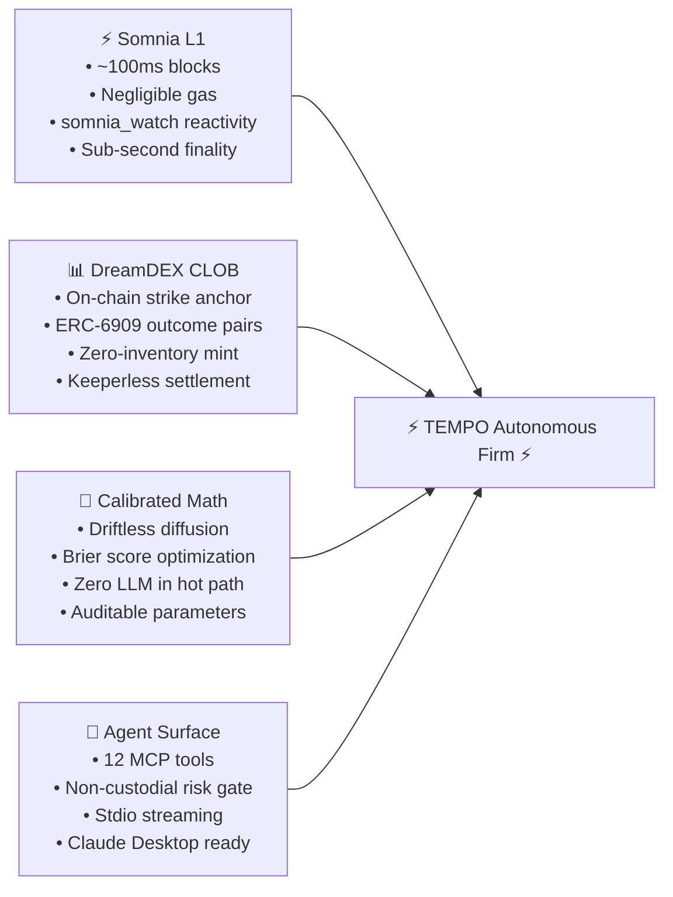
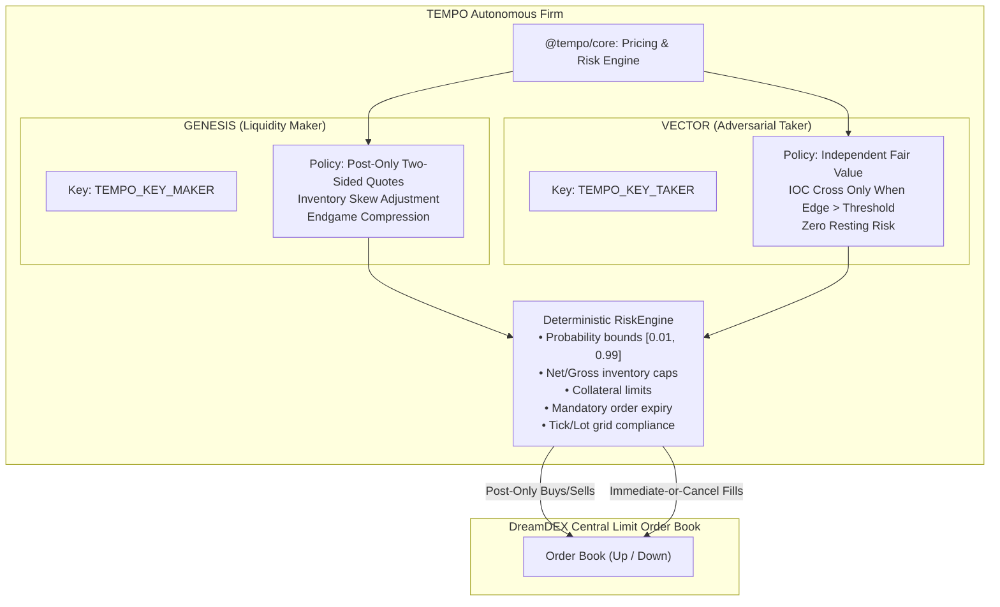
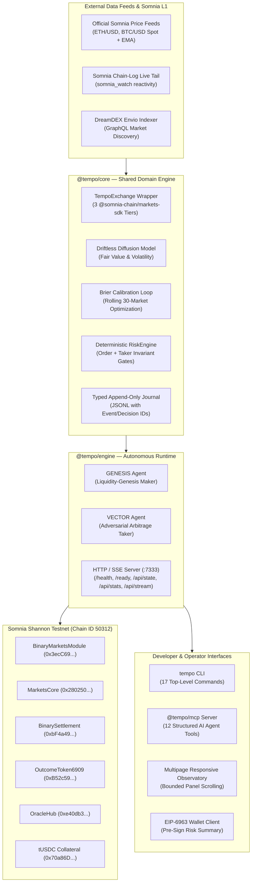

<div align="center">

  

  # TEMPO

  

  ### ⚡ Every DreamDEX Event Contract is born with an empty book. TEMPO is the opening auction. ⚡

  <br />

  <a href="https://www.typescriptlang.org/"></a>
  <a href="https://somnia.network/"></a>
  <a href="https://dreamdex.io/"></a>
  <a href="https://nodejs.org/"></a>
  <a href="test/reports/readme-audit-20260905.md"></a>
  <a href="test/reports/zero-mock-audit.md"></a>
  <a href="test/reports/security.md"></a>

  <br /><br />

  <a href="https://github.com/Kevincruz2005/Tempo">🐙 GitHub Repository</a> •
  <a href="#verified-on-chain-proof--transactions">📜 On-Chain Proof</a> •
  <a href="#system-architecture">🏛️ Architecture</a> •
  <a href="SUBMISSION.md">📋 Hackathon Submission</a> •
  <a href="docs/DESIGN.md">📐 Design Document</a> •
  <a href="test/reports/">📑 Evidence Reports</a>

</div>

---

## 📑 Table of Contents

1. [Executive Summary & The Problem](#executive-summary--the-problem)
2. [The Novelty: Autonomous Opening Auction](#the-novelty-autonomous-opening-auction)
3. [Competitive Differentiation Matrix](#competitive-differentiation-matrix)
4. [Foundational Thesis: Why Somnia, DreamDEX, AI & MCP?](#foundational-thesis-why-somnia-dreamdex-ai--mcp)
5. [Live Operational Metrics & Ground Truth](#live-operational-metrics--ground-truth)
6. [The 9-Stage Autonomous Lifecycle](#the-9-stage-autonomous-lifecycle)
7. [The Dual-Agent Firm Architecture (GENESIS & VECTOR)](#the-dual-agent-firm-architecture-genesis--vector)
8. [Mathematical Pricing & Brier Calibration Model](#mathematical-pricing--brier-calibration-model)
9. [System Architecture](#system-architecture)
10. [Verified On-Chain Proof & Transactions](#verified-on-chain-proof--transactions)
11. [Developer Surface: CLI, SDK, MCP & Web Observatory](#developer-surface-cli-sdk-mcp--web-observatory)
12. [Non-Custodial Connect Wallet & Pre-Sign Safety](#non-custodial-connect-wallet--pre-sign-safety)
13. [Security Hardening, Zero-Mock Policy & Risk Controls](#security-hardening-zero-mock-policy--risk-controls)
14. [Installation, Configuration & Runbook](#installation-configuration--runbook)
15. [Failure Handling & Operational Resilience](#failure-handling--operational-resilience)
16. [Known Limitations](#known-limitations)
17. [Business & Ecosystem Impact (Judging Alignment)](#business--ecosystem-impact-judging-alignment)
18. [Roadmap & Future Vision](#roadmap--future-vision)
19. [A–Z Application & Proof Map](#az-application--proof-map)
20. [Evidence Index & Verification Links](#evidence-index--verification-links)

---

<a id="executive-summary--the-problem"></a>
## 💡 Executive Summary & The Problem

DreamDEX deploys rolling prediction market windows across high-velocity crypto assets (BTC, ETH) spanning durations from 60 seconds to 24 hours. Each window is born with:
- An **empty Central Limit Order Book (CLOB)**,
- A fixed **on-chain opening strike price**, and
- A hard **expiry deadline**.

### The Empty-Book Dilemma
When an ephemeral event market opens, it opens in total silence. Without initial liquidity, there is no price discovery, no bid-ask spread, and no trading activity. On-chain validation on Somnia Shannon testnet revealed the harsh consequence: **numerous finalized windows lived and died with `tradeCount: 0`** — markets that never traded a single contract because no participant quoted the opening.

```
Traditional Exchanges:   [ Listing ] ──> [ Opening Auction ] ──> [ Continuous Trading ] ──> [ Close ]
                                                 ▲
                                       (Solved centuries ago)

DreamDEX Windows:        [ Birth ]   ──> [ EMPTY BOOK ]    ──> [ Expiry ] ──> [ Settled (tradeCount: 0) ]
                                                 ▲
                                    (TEMPO solves this gap)
```

### Why Traditional Market Makers Fail Here
1. **Economic Impossibility**: No human trader can manually discover, price, quote, manage risk, settle, and roll across markets that expire in 60 seconds.
2. **Circular Quoting Bots**: Standard market-making bots (such as the DreamDEX bot kit's `ec-maker`) compute quotes based on the **mid-price of an existing order book**. When the book is completely empty at birth, they fall back to an arbitrary default (`0.50`), completely detached from the asset's true spot price and historical volatility.
3. **No Lifecycle Coverage**: Traditional bots poll periodically to place quotes, but abandon windows during settlement, void handling, and capital roll-over.

### The Solution: TEMPO
**TEMPO is the autonomous opening auction for DreamDEX Event Contracts on Somnia.**
It is an autonomous agent firm that observes every discovered configured-asset window and actively manages the supported 1m, 5m, 15m, 1h, 4h, and 24h cadences. It anchors managed windows with derived two-sided liquidity before any book exists, controls the endgame, claims settlements on-chain, and rolls capital into successors.

**TEMPO transforms a series of disconnected, ephemeral windows into one continuous, liquid prediction venue.**

---

<a id="the-novelty-autonomous-opening-auction"></a>
## 🌟 The Novelty: Autonomous Opening Auction

TEMPO is not another quoting bot that sits on top of an existing market. **TEMPO creates the market.** It introduces four new financial and agentic primitives:

1. **Liquidity Genesis**: Supplying the foundational two-sided book to a newly born window without requiring pre-funded outcome-token inventory, using resting bids on both Up and Down through the protocol's mint-a-pair mechanism. Collateral, fill, and inventory risk remain explicitly capped.
2. **The Anchoring**: Estimating mathematically rigorous fair values using continuous driftless diffusion ($\Phi(\cdot)$) computed from the official Somnia oracle feed versus the on-chain opening strike price *before any external order book exists*.
3. **Verifiable Trading Intelligence**: Eliminating black-box unpredictability. Every estimate is journaled as a `MODEL ESTIMATE` before any transaction is signed. Every settled outcome is evaluated against ground truth via Brier score scoring, driving deterministic, bounded self-calibration.
4. **The Continuous Roll**: Automatically observing on-chain settlement, executing void-aware redemptions, and immediately reallocating recovered collateral into successor windows.

---

<a id="competitive-differentiation-matrix"></a>
## 🥊 Competitive Differentiation Matrix

| | Bot-kit `ec-maker` (the baseline judges know) | TEMPO |
|---|---|---|
| Trigger | 10-second polling loop | Chain-log/feed subscriptions with bounded polling fallback |
| Fair value | Mid of the *existing* book; 0.5 when empty | Computed from the official oracle feed vs the **on-chain opening price** — before a book exists |
| Role | Quotes a market that already has prices | **Creates the market at birth** (liquidity genesis) |
| Inventory | Mints sets to sell | Zero-inventory two-sided quote via mint-a-pair resting buys |
| Endgame | None | Time-decaying spread tightening + certainty skew policy |
| Settlement | Claim sweep | Observe on-chain resolution → void-aware redeem → automatic roll |
| Learning | None | Brier-scored calibration epochs, clamped, journaled |
| Evidence | Console logs | Typed journal + `tempo verify` cross-checks every tx hash on-chain |
| Interface | — | CLI + published SDK + MCP server + multipage responsive observatory |

> *"ec-maker is a quoting loop. TEMPO is a lifecycle — and its intelligence is measured, not claimed."*

---

<a id="foundational-thesis-why-somnia-dreamdex-ai--mcp"></a>
## 🔴 Foundational Thesis: Why Somnia, DreamDEX, AI & MCP?

TEMPO's architecture is tightly coupled to its technological environment. None of its components are interchangeable.



### 1. Why Somnia? (Load-Bearing Infrastructure)
- **~100 ms Block Times & Sub-Second Finality**: Event contracts expiring in 60 seconds require sub-second cancel/replace cycles. On Ethereum or high-latency L2s, quoting latency guarantees toxic flow execution.
- **Negligible Gas Costs**: Continuous re-pricing across multiple live windows is economically viable on Somnia. On Ethereum L1, gas costs per quote replace would destroy all market-making yield within minutes.
- **`somnia_watch` Reactivity**: Transaction and book subscriptions deliver live updates without relying only on a timer; bounded polling remains the explicit fallback when the live tail is unavailable.
- **One-Round-Trip Writes (`realtime_sendRawTransaction`)**: Enables submission and receipt validation in a single round-trip, eliminating pending-transaction limbo.
- **Keeperless Settlement**: DreamDEX resolves windows on-chain via oracle delivery through Somnia's native reactivity. No off-chain keeper or cron is required.

### 2. Why DreamDEX? (The Mechanism)
- **On-Chain Opening Boundary**: The exact strike price is committed on-chain at window birth, providing the reference anchor for fair-value diffusion.
- **Mint-a-Pair Path**: Resting bids on Up and Down simultaneously allow the venue to mint complete sets on fill, achieving two-sided liquidity with **zero pre-funded inventory**.
- **Mandatory Order Expiry**: Order lifetimes are cryptographically capped at window expiry, serving as a protocol-level dead-man's switch against stale quote risk.
- **CREATE3 Identical Protocol Deployments**: Predictable, immutable contract interfaces across testnet (50312) and mainnet (5031).

### 3. Why Event Contracts? (The Product)
Binary outcome event contracts with discrete expiries, guaranteed settlement boundaries, and automatic void resolutions provide the formal mathematical structure necessary for risk-bounded algorithmic market making.

### 4. Why AI & Calibration? (And why NO LLM in the Hot Path)
- **Zero LLMs in the Execution Path**: Somnia's 100ms block cadence makes remote LLM API calls (200ms–2,000ms latency, rate limits, non-deterministic formatting) completely unusable for trade decisions. 
- **Driftless Diffusion Engine**: The real-time pricing engine uses a synchronous, deterministic closed-form diffusion calculation ($\Phi$) rather than a remote model call.
- **Self-Grading Calibration Loop**: Every resolved window grades the firm's pre-expiry probability against on-chain outcome facts using the **Brier score**. A bounded temperature-calibration loop adjusts volatility multipliers and taker edge within strict $[0.5x, 2.0x]$ operator boundaries.
- **Cold-Path AI Narrative**: An optional LLM generates natural language governance reports derived strictly from journal facts, explicitly labeled `AI NARRATIVE`.

### 5. Why Model Context Protocol (MCP)?
Provides 12 standardized, schema-validated MCP tools allowing external autonomous agents (such as Claude Desktop or autonomous treasury agents) to inspect markets, read books, calculate fair values, and safely execute trades through TEMPO's deterministic risk engine.

---

<a id="live-operational-metrics--ground-truth"></a>
## 📊 Live Operational Metrics & Ground Truth

Operational figures below are derived from the dated journal and on-chain receipts on Somnia Shannon testnet (Chain ID `50312`); quality figures come from deterministic settlement scoring, and repository-quality figures come from the linked checks. No metric is synthetic.

| Metric | Live Value | Provenance & Evidence Link |
|:---|:---|:---|
| **Operating Network** | **Somnia Shannon Testnet (50312)** | [`test/reports/live-read-20260902.md`](test/reports/live-read-20260902.md) |
| **Active Venue** | **DreamDEX Binary Event Contracts** | [`test/reports/contract-live.md`](test/reports/contract-live.md) |
| **Windows Observed at Birth** | **2,381 windows** (BTC 1,201 / ETH 1,180) | [`test/reports/business-impact-20260905.md`](test/reports/business-impact-20260905.md) |
| **Agent Decisions Journaled** | **8,805 decisions** | [`test/reports/business-impact-20260905.md`](test/reports/business-impact-20260905.md) |
| **Real Orders Broadcast** | **2,004 orders** | [`test/reports/business-impact-20260905.md`](test/reports/business-impact-20260905.md) |
| **Unique Transaction Hashes** | **1,464 hashes** | [`test/reports/business-impact-20260905.md`](test/reports/business-impact-20260905.md) |
| **Funded Sample Verification** | **31/31 successful receipts (100%)** | [`test/reports/verify-20260902.md`](test/reports/verify-20260902.md) |
| **On-Chain Fills Observed** | **100 fills / 1,255.625 tUSDC matched notional** | [`test/reports/business-impact-20260905.md`](test/reports/business-impact-20260905.md) |
| **Settlement Claims Executed** | **13 claims** | [`test/reports/business-impact-20260905.md`](test/reports/business-impact-20260905.md) |
| **Brier Score Calibration** | **0.0561 across 18 scored markets** | [`test/reports/business-impact-20260905.md`](test/reports/business-impact-20260905.md) |
| **Directional Forecasting Accuracy** | **94.4%** (17/18) | [`test/reports/business-impact-20260905.md`](test/reports/business-impact-20260905.md) |
| **Venue Trading / Settlement Fees** | **0% / 0%** | [`docs/sources/raw/dreamdex-trading_event-contracts.md`](docs/sources/raw/dreamdex-trading_event-contracts.md) |
| **Automated Test Suite** | **2,117 tests passing** (18 test files) | [`test/reports/readme-audit-20260905.md`](test/reports/readme-audit-20260905.md) |
| **Economic Invariant Matrix** | **2,048 cases tested** (6 & 18 decimals) | [`test/reports/offline-20260903.md`](test/reports/offline-20260903.md) |
| **Security Vulnerabilities** | **0 vulnerabilities** (`npm audit`) | [`test/reports/security.md`](test/reports/security.md) |
| **Mocked Economic Values** | **0 mocked values** | [`test/reports/zero-mock-audit.md`](test/reports/zero-mock-audit.md) |

---

<a id="the-9-stage-autonomous-lifecycle"></a>
## 🔄 The 9-Stage Autonomous Lifecycle

TEMPO manages every event contract through a nine-state engine lifecycle. The compact dashboard timeline folds the short `LOCK` transition into expiry control and therefore displays eight operator-facing milestones. The canonical engine type and transition implementation are linked in the [A–Z proof map](#az-application--proof-map).

```text
  [ 1. BIRTH ] ────────> [ 2. ANCHOR ] ───────> [ 3. GENESIS ]
       │                      │                      │
  Discovered via        Driftless diffusion     Zero-inventory
  Somnia log tail       pricing vs strike       two-sided quote
       │                      │                      │
       ▼                      ▼                      ▼
  [ 4. REPRICE ] <────> [ 5. ENDGAME ] ───────> [ 6. LOCK ]
       │                      │                      │
  Event-driven cancel/  Spread compression;     Trading halts;
  replace on ticks      certainty skewing       stale orders purged
       │                      │                      │
       ▼                      ▼                      ▼
  [ 7. SETTLE ] ───────> [ 8. CLAIM ] ────────> [ 9. ROLL ]
       │                      │                      │
  Oracle resolves via   Winnings redeemed on-   Capital allocated
  Somnia reactivity     chain (void-aware)      to successor window
```

1. **BIRTH**: The window is deployed by the DreamDEX factory. TEMPO detects the new market through the chain-log live path or its bounded discovery fallback and journals the birth once per market ID.
2. **ANCHOR**: The appraiser computes the opening fair value from the official oracle feed ($S_t$) versus the on-chain opening price ($K$) before any counterparty book exists.
3. **GENESIS**: GENESIS places resting buy orders on both Up at $(p - \delta)$ and Down at $((1 - p) - \delta)$. The protocol mints a complete pair when crossed, requiring zero initial outcome tokens.
4. **REPRICE**: Live feed, book, and interval events trigger a new estimate. When the underlying price, time, or inventory changes materially, GENESIS cancels and replaces stale quotes through the bounded executor.
5. **ENDGAME**: As expiration nears, spread tightens proportionally to $\sqrt{\tau}$ while quotes skew toward the high-probability outcome.
6. **LOCK**: At expiration ($t = T$), all quoting halts. Any remaining open orders are purged.
7. **SETTLE**: Somnia's on-chain reactivity delivers oracle answers to `BinarySettlement`. The market moves to status `Finalized`.
8. **CLAIM**: TEMPO observes finalization, determines the winning outcome (or handles voided markets at 50/50 payout), and redeems collateral tokens on-chain.
9. **ROLL**: Collateral is recycled into the next newborn window. The loop continues indefinitely.

---

<a id="the-dual-agent-firm-architecture-genesis--vector"></a>
## 🤖 The Dual-Agent Firm Architecture (GENESIS & VECTOR)

TEMPO operates as a bona fide autonomous trading firm composed of two distinct agents with separate wallets, separate private keys, and adversarial economic objectives.



### 1. GENESIS (Liquidity-Genesis Maker)
- **Role**: Establishes and maintains continuous two-sided liquidity.
- **Order Type**: Exclusively `Post-Only`. If market conditions shift such that an order would cross the spread, the transaction fails safe (`PostOnlyWouldCross`) and immediately triggers a re-quote.
- **Inventory Management**: Dynamically shifts bid/ask spreads based on inventory skew:
  $$\Delta_{\text{skew}} = -\gamma \cdot \frac{q_{\text{net}}}{q_{\text{max}}}$$
- **Capital Discipline**: Uses a configured lot-quantized quote size, time-decaying spread, inventory skew, per-order collateral limits, and firm-level capital caps.

### 2. VECTOR (Adversarial Arbitrage Taker)
- **Role**: Disciplines the order book and tests GENESIS's quotes against external price shifts.
- **Order Type**: Exclusively `Immediate-or-Cancel (IOC)`. Never leaves passive orders resting on the book.
- **Trigger**: Crosses the spread only when the book's best offer deviates from its independent fair-value estimate by more than the calibrated edge threshold:
  $$\text{Edge} = |p_{\text{book}} - p_{\text{fair}}| > \delta_{\text{calibrated}}$$
- **Safety**: Rejects trades if available liquidity or price slippage violates configured risk parameters.

### 3. The Deterministic Risk Engine
Every new order from either agent, the CLI, the web wallet, or the MCP server passes through `packages/core/src/risk.ts` before signing. Other mutations—cancel, mint, faucet, and redeem—remain chain/status gated and obey the global pause switch:
- **Probability Boundary**: Rejects orders outside the open interval $(0, 1)$; venue tick quantization then enforces the live pool grid.
- **Lot & Tick Grid Alignment**: Quantizes all prices and quantities to the on-chain pool's exact tick size and lot size.
- **Per-Order Collateral Cap**: Enforces maximum collateral risk per individual transaction.
- **Net & Gross Inventory Caps**: Limits total exposure per window and across the entire firm.
- **Mandatory Order Expiry**: Enforces order expiration timestamps capped strictly at the window's expiry.
- **Emergency Circuit Breakers**: Rejects new orders after the per-window realized-loss cap and shuts down all writes when `TEMPO_PAUSED=true`.

---

<a id="mathematical-pricing--brier-calibration-model"></a>
## 🧠 Mathematical Pricing & Brier Calibration Model

### 1. Continuous Driftless Diffusion Model
Event contracts settle binary payouts based on whether the final oracle price is above or below the opening strike:
$$\text{Payoff} = \begin{cases} 1 & \text{if } S_T \ge K \\ 0 & \text{if } S_T < K \end{cases}$$

Under TEMPO's short-horizon driftless log-price diffusion, the estimated probability that the contract expires in the money is:

$$p(\text{Up}) = \Phi\left( \frac{\ln(S_t / K)}{\sigma \sqrt{\tau}} \right)$$

Where:
- $S_t$: Current spot price from the official Somnia price feed.
- $K$: On-chain opening strike price registered at market birth.
- $\sigma$: Realized log-return volatility per square-root second, computed from timestamped official-feed observations.
- $\tau$: Seconds remaining until expiration.
- $\Phi(z)$: Cumulative standard normal distribution function:
  $$\Phi(z) = \frac{1}{\sqrt{2\pi}} \int_{-\infty}^z e^{-\frac{u^2}{2}} \, du$$

### 2. Brier Score Self-Grading Mechanism
Rather than relying on uncalibrated model outputs, TEMPO continuously evaluates its probability estimates against ground truth on-chain settlements using the strictly proper **Brier Score**:

$$BS = \frac{1}{N} \sum_{i=1}^N \left( \hat{p}_i - y_i \right)^2$$

Where:
- $\hat{p}_i \in [0, 1]$ is the last model probability estimate recorded before expiry.
- $y_i \in \{0, 1\}$ is the actual on-chain settlement result ($1 = \text{Up wins}$, $0 = \text{Down wins}$).
- Voids are excluded from scoring.

*A Brier score of `0.0` denotes perfect predictive calibration; `0.25` is equivalent to an uninformed coin-flip; `> 0.25` represents pathological miscalibration.*
- **Dated evidence snapshot**: **0.0561 Brier** and **94.4% directional accuracy** across 18 scorable testnet windows ([calculation evidence](test/reports/business-impact-20260905.md)).

### 3. Closed-Loop Brier Calibration Loop
After settlement sweeps, TEMPO evaluates a deterministic calibration epoch over the latest 30 eligible settled markets. Normal operation requires at least 25 scored markets and duplicate window fingerprints are gated:
1. Calculates aggregate Brier score and directional accuracy from the closest eligible pre-expiry estimate for each outcome.
2. Fits a bounded probability temperature and evaluates adjustments for two parameters:
   - **$\sigma$-Multiplier**: Widens or narrows the fair-value probability distribution based on empirical forecast volatility.
   - **Taker Edge Threshold ($\delta$)**: Tunes VECTOR's crossing sensitivity based on realized fill profitability.
3. **Hard Mathematical Clamps**: Learned parameters are clamped strictly to **$[0.5x, 2.0x]$** of operator defaults; calibration never changes capital or inventory risk caps.

---

<a id="system-architecture"></a>
## 🏛️ System Architecture



**Architectural Principle: One Core, Four Surfaces.**
Market calculations, risk checks, transaction preparation, and verification rules live in `@tempo/core`. The CLI, MCP server, web observatory, and browser-wallet flow reuse that core; the firm daemon coordinates it inside `@tempo/engine`.

---

<a id="verified-on-chain-proof--transactions"></a>
## ✅ Verified On-Chain Proof & Transactions

### DreamDEX Protocol Deployments (Somnia Shannon Testnet 50312)
These official protocol contracts use CREATE3 and are byte-for-byte identical on Somnia Mainnet (Chain ID 5031):

| Contract Name | Address | Function in TEMPO Lifecycle |
|:---|:---|:---|
| **BinaryMarketsModule** | [`0x3ecC694Cef705358864a646142ac17A90E29e388`](https://shannon-explorer.somnia.network/address/0x3ecC694Cef705358864a646142ac17A90E29e388) | Factory contract; emits `MarketCreated` at window birth |
| **MarketsCore** | [`0x2802504314685D89bF6C992CA5a8e7cC78bc0294`](https://shannon-explorer.somnia.network/address/0x2802504314685D89bF6C992CA5a8e7cC78bc0294) | Central limit order book execution and order matching |
| **BinarySettlement** | [`0xbF4a49e0Dfd092e5FBE8E5761064C49533e6Ed23`](https://shannon-explorer.somnia.network/address/0xbF4a49e0Dfd092e5FBE8E5761064C49533e6Ed23) | Settles resolved windows via oracle inputs; redeems payouts |
| **OutcomeToken6909** | [`0xB52c5934113Af5c0Bb20eb3C72290C8215f755b9`](https://shannon-explorer.somnia.network/address/0xB52c5934113Af5c0Bb20eb3C72290C8215f755b9) | Multi-token contract for binary Up/Down outcomes |
| **OracleHub** | [`0xe40db387cC98601Dd11bd634fF2f3AD5686dE32b`](https://shannon-explorer.somnia.network/address/0xe40db387cC98601Dd11bd634fF2f3AD5686dE32b) | Official pricing oracle delivering final resolution values |
| **CollateralRouter** | [`0xbC0C9834B15ACE38bB50dDaa7d7f7C7CC4DC183C`](https://shannon-explorer.somnia.network/address/0xbC0C9834B15ACE38bB50dDaa7d7f7C7CC4DC183C) | Routes collateral deposits and pair-minting locks |
| **Testnet Collateral (tUSDC)** | [`0x70a86D8842FB63C4Ad2b7cdddF530eBf1BB25d8E`](https://shannon-explorer.somnia.network/address/0x70a86D8842FB63C4Ad2b7cdddF530eBf1BB25d8E) | 6-decimal settlement token for market collateral |

### Verified Lifecycle Transactions (Market `BTC-0-02SEP26-1200/tUSDC`)
Every transaction below is real, indexed on Somnia Shannon testnet, and independently verified via `tempo verify`:

| Action / Stage | Agent | Block | Transaction Hash (Clickable Shannon Explorer) | Status |
|:---|:---|---:|:---|:---|
| **Collateral Faucet** | GENESIS | 477740388 | [`0x7a78a4f4...`](https://shannon-explorer.somnia.network/tx/0x7a78a4f4ca13cc59c94ee6d1a78c03bead20112ef71ae1adcd1f3850b4f6561a) | `success` |
| **Collateral Faucet** | VECTOR | 477740400 | [`0xb51c35c9...`](https://shannon-explorer.somnia.network/tx/0xb51c35c96f3bcd8b061c4f956b946d2177d1276f7ca1c9849ee16aeb160375b1) | `success` |
| **Mint Complete Set** | GENESIS | 477740614 | [`0xe4cfacbc...`](https://shannon-explorer.somnia.network/tx/0xe4cfacbcccf7100a16bdec6d91b77b7a36d1137125cd6f072115b05c14c31710) | `success` |
| **Post-Only Anchor Quote** | GENESIS | 477740795 | [`0x61df8841...`](https://shannon-explorer.somnia.network/tx/0x61df8841b3fe0b505415ce28f983c888f24c8bce712d32003cdce6416af9e0b7) | `success` |
| **Cancel Stale Order** | GENESIS | 477740941 | [`0xec1a6450...`](https://shannon-explorer.somnia.network/tx/0xec1a645007bc031ddf1ea16e5d21b1bdf6291f634dee9c03955c37f1506028ed) | `success` |
| **Post-Only Sell (Inventory)** | GENESIS | 477741128 | [`0x55343bb3...`](https://shannon-explorer.somnia.network/tx/0x55343bb33a3683fd4077f28e724e931b7d9977b7e0d812252369a8f05268ac23) | `success` |
| **IOC Take (Real Fill)** | VECTOR | 477741474 | [`0x3d2cc41d...`](https://shannon-explorer.somnia.network/tx/0x3d2cc41de74db30eb8811609cdee105e9657a7dce2b463236b3a5618a6b26079) | `success` |
| **Firm Quote Update** | GENESIS | 477755832 | [`0x9d50bdd2...`](https://shannon-explorer.somnia.network/tx/0x9d50bdd28b21e0bfa31e93d0e755dcbe6eeb0a441f46cd4e96c14ef4a235b175) | `success` |
| **Firm Quote Update** | GENESIS | 477755863 | [`0xdec9f670...`](https://shannon-explorer.somnia.network/tx/0xdec9f670f195f7d7599445edd83b170cf14672b53715fcbc1bdca0e4145d26a4) | `success` |
| **On-Chain Claim** | GENESIS | 477940746 | [`0xd9aad147...`](https://shannon-explorer.somnia.network/tx/0xd9aad1477ac2e99a8ec4281b5c447ca9b5c3d625600eb59ae9a938889bf2ac5e) | `success` |

---

<a id="developer-surface-cli-sdk-mcp--web-observatory"></a>
## 🧰 Developer Surface: CLI, SDK, MCP & Web Observatory

TEMPO exposes four purpose-built interfaces sharing the identical TypeScript core.

### 1. `tempo` CLI (17 Top-Level Commands)

```bash
# Venue Diagnostics & Probing
tempo doctor                         # Read-only health probe across RPC, indexer, price feeds, and keys
tempo markets                        # List all active rolling windows, strike boundaries, and expiry timers
tempo watch [--asset BTC]            # Live streaming terminal view of newborn windows and book updates
tempo book <fragment>                # Materialize the full order book, tick/lot grid, and fair-value band

# Agent Status & Portfolios
tempo agents                         # Display GENESIS and VECTOR balances, status, and policy state
tempo positions                      # Inspect ERC-6909 outcome token balances and collateral claims

# Operating the Firm
tempo firm simulate                  # Run the firm in dry-run mode (journals decisions without signing txs)
tempo firm start                     # Launch the live firm on Somnia testnet (requires funded agent keys)
tempo trade <ref> <up|down> <qty>    # Manually execute an IOC order through the core RiskEngine

# Settlement, Analytics & Calibration
tempo claims [--claim]               # List finalized markets and claim available payouts
tempo settlements [--limit N]        # Review recently settled windows with oracle resolution links
tempo activity [--n N]               # Stream recent journal events, decisions, and transaction hashes
tempo verify                         # Cross-reference every transaction hash in the journal directly via RPC
tempo backtest [--limit N]           # Backtest pricing models against historical settlement records
tempo report [--llm]                 # Generate a formal Brier performance report (optional cold-path LLM)
tempo calibrate [--force]            # Execute an on-demand calibration epoch over resolved markets
tempo mcp                            # Launch the Model Context Protocol stdio server for AI agents
tempo faucet                         # Mint testnet collateral (tUSDC) for configured accounts
```

### 2. `@tempo/core` Typed Node.js SDK (v0.3.0)

Built for Node.js $\ge 20$, strict ESM TypeScript, complete with CycloneDX SBOM and cryptographic checksums.

```bash
# Anonymous direct install from release artifact
npm install https://github.com/Kevincruz2005/Tempo/releases/download/sdk-v0.3.0/tempo-core-0.3.0.tgz
```

```typescript
import { fairValue, loadConfig, realizedVolPerSqrtSec, TempoExchange } from "@tempo/core";

// 1. Initialize exchange with validated configuration
const config = loadConfig();
const exchange = new TempoExchange({ config });

try {
  const markets = await exchange.markets();
  const market = markets[0];
  if (!market) throw new Error("NO DATA");

  const chain = await exchange.onchain(market.marketId);
  if (chain.status !== 1) throw new Error("Market is not trading");

  const spot = await exchange.spot(market.asset);
  const opening = await exchange.openingPrice(market.marketId, spot?.price);
  const history = await exchange.spotHistory(market.asset, { limit: 60 });
  const sigmaPerSqrtSec = realizedVolPerSqrtSec(history);
  if (!spot || opening === undefined || !Number.isFinite(sigmaPerSqrtSec)) {
    throw new Error("NO DATA");
  }

  const estimate = fairValue({
    spot: spot.price,
    strike: opening,
    sigmaPerSqrtSec,
    secondsLeft: Math.max(0, market.expiry - Date.now() / 1000),
  });

  console.log({ market: market.symbol, chainStatus: chain.status, spot, opening, estimate });
} finally {
  await exchange.close();
}
```

### 3. `@tempo/mcp` Server (12 Structured Tools for AI Agents)

TEMPO implements an Model Context Protocol (MCP) server over `stdio`. It exposes 10 read tools, 1 dry-run simulation tool, and 1 strictly guarded write tool:

| Tool Name | Type | Description |
|:---|:---|:---|
| `discover_markets` | Read | Queries active rolling event contract windows with expiry timers |
| `inspect_event_contract` | Read | Returns on-chain parameters: strike, status, tick/lot grid, addresses |
| `get_live_book` | Read | Materializes the current order book with depth and spread metrics |
| `get_fair_value` | Read | Computes diffusion fair-value probabilities and uncertainty bands |
| `get_settlement` | Read | Checks finalized status, winning outcome, and oracle audit proof |
| `get_firm_status` | Read | Reports agent balances, inventory skew, and calibration state |
| `get_positions` | Read | Returns outcome token balances and redeemable claims |
| `get_activity_tape` | Read | Streams recent journal entries, decisions, and transaction receipts |
| `verify_receipt` | Read | Directly queries the Somnia RPC to verify an on-chain transaction hash |
| `get_risk_parameters`| Read | Returns active risk caps, position limits, and circuit breaker status |
| `simulate_trade` | Sim | Simulates an order through the RiskEngine without signing or broadcasting |
| `place_order` | **Write** | Executes an IOC order (**Gated behind `TEMPO_MCP_WRITES=true` & signer**) |

#### Claude Desktop Configuration (`claude_desktop_config.json`)
```json
{
  "mcpServers": {
    "tempo": {
      "command": "node",
      "args": ["/absolute/path/to/Tempo/packages/mcp/dist/index.js"],
      "env": {
        "TEMPO_NETWORK": "testnet",
        "TEMPO_RPC_URL": "https://50312.rpc.thirdweb.com",
        "TEMPO_MCP_WRITES": "false"
      }
    }
  }
}
```

### 4. Web Observatory (Multipage, Responsive Observatory)

Served locally at `http://127.0.0.1:7333`, the web observatory provides an industrial-grade multipage experience: a one-monitor command surface with bounded internal panel scrolling, responsive mobile pages, and direct links for every market and evidence surface:
- **Live Active Windows**: Real-time ticker cards showing strike, spot, seconds-left countdown, and market status.
- **Materialized Order Book**: Bid/Ask depth chart with dynamic spread indicators and tick grids.
- **Fair-Value Probability Band**: Live visualization of the appraiser's probability band versus current market mid.
- **Agent Firm Roster**: Live native STT and collateral tUSDC balances for GENESIS and VECTOR.
- **Journal Activity Tape**: Real-time SSE streaming tape of every market event, decision plan, and on-chain transaction hash.
- **Settlement & Audit Feed**: Settled window records featuring direct Somnia Explorer links to the resolving oracle transaction.
- **REST Endpoints**:
  - `GET /health`: Deterministic liveness response with no secrets exposed.
  - `GET /ready`: Bounded 503/200 readiness probe checking indexer, RPC head, feeds, and live tail.
  - `GET /api/state`: Sanitized firm snapshot.
  - `GET /api/stats`: Journal-derived intelligence and ecosystem-impact aggregates.
  - `GET /api/journal?n=60`: Bounded recent sanitized journal records.
  - `GET /api/narrative`: Optional, explicitly labeled cold-path narrative state.
  - `GET /api/stream`: Real-time Server-Sent Events (SSE) feed.
  - `GET /api/wallet/config`, `/activity`, `/prepare`: Browser-wallet discovery, attributed activity, and unsigned pre-sign review.

---

<a id="non-custodial-connect-wallet--pre-sign-safety"></a>
## 🔒 Non-Custodial Connect Wallet & Pre-Sign Safety

TEMPO includes a fully non-custodial web wallet flow built to adhere to institutional security standards:

```
[ Browser ] ──(EIP-6963 Discovery)──> [ Injected Wallet (MetaMask / Rabby) ]
     │
     ▼
[ User Selects Outcome & Size ] ────> [ Safe Pre-Sign Summary Modal ]
                                               │
                                               ├─ Market Symbol & Expiry
                                               ├─ Side: Up / Down
                                               ├─ Limit Price & Lot Quantization
                                               ├─ Max Collateral Cost (tUSDC)
                                               ├─ Target Contract Destination
                                               └─ Native Gas Pre-Flight Check
                                               │
                                               ▼
[ User Explicitly Clicks Confirm ] ──> [ Wallet Signs & Broadcasts ]
```

### Strict Safety Invariants:
1. **Zero Key Exposure**: Agent keys (GENESIS/VECTOR) remain strictly inside the engine daemon; they are never sent to the browser.
2. **No Blind Signing**: The user is presented with a complete transaction breakdown before the wallet is requested to sign.
3. **Chain Gating**: The UI continuously monitors chain ID (`50312`). If the wallet switches networks, the trading interface instantly locks with a "Wrong Network" safety banner.
4. **Read-Only Watch Mode**: Users can connect an address in read-only mode to watch their address-attributed fills in the activity tape without granting signature permissions.

---

<a id="security-hardening-zero-mock-policy--risk-controls"></a>
## 🛡️ Security Hardening, Zero-Mock Policy & Risk Controls

### 1. Zero-Mock Policy & Provenance Model
TEMPO enforces an uncompromising Zero-Mock policy across the entire system. Every data point rendered in the UI, emitted over SSE, printed in the CLI, or provided via MCP carries an explicit provenance tag:

| Provenance Class | Definition | Verification Source |
|:---|:---|:---|
| `price-feed` | Real-time price facts | Official Somnia price feed contract / API |
| `on-chain` | Immutable ledger facts | Somnia Shannon RPC / Contract view calls |
| `policy` | Deterministic agent rules | Open-source TypeScript strategy algorithms |
| `derived` | Mathematical calculations | Formulaic outputs from verified facts |
| `MODEL ESTIMATE` | Statistical probability estimates | Driftless diffusion model over verified inputs |
| `AI NARRATIVE` | Cold-path natural language text | Offline LLM summarizing verified journal facts |

*If data is temporarily unavailable from upstream sources, TEMPO renders `UNAVAILABLE`, `PENDING`, or `NO DATA`. It never fabricates placeholder numbers or synthetic transactions.*

### 2. Security Boundaries & Threat Model
- **No SQL Injection Surface**: TEMPO does not use SQL databases; data is stored in memory and streamed to immutable append-only JSONL journal files.
- **Web Application Hardening**: Loopback address binding by default (`127.0.0.1`), strict Content Security Policy (CSP), frame denial (`X-Frame-Options: DENY`), MIME-sniffing protection (`X-Content-Type-Options: nosniff`), and no-referrer policies.
- **Input Sanitization**: MCP tool arguments are validated via Zod schemas and capped at 16 KiB to prevent buffer overflow or DoS attacks.
- **Secret Redaction**: A recursive sanitizer scrubs private keys, mnemonic phrases, and authorization headers from all logs, error stacks, API responses, and journal files.
- **Emergency Pause Switch**: Setting `TEMPO_PAUSED=true` immediately halts all trading, quoting, and claiming writes across all components.

---

<a id="installation-configuration--runbook"></a>
## 🛠️ Installation, Configuration & Runbook

### Prerequisites
- **Node.js $\ge 20.0.0$**
- **npm $\ge 10.0.0$**
- Git

### 1. Clone & Build
```bash
git clone https://github.com/Kevincruz2005/Tempo.git
cd Tempo
npm install
npm run build:sdk
npm test                  # Runs all 2,117 offline invariant and integration tests
```

### 2. Configuration (`.env`)
Copy the template configuration:
```bash
cp .env.example .env
```

Key environment parameters:
```bash
# Network & RPC Settings
TEMPO_NETWORK=testnet
# Recommended: Thirdweb RPC provides high availability when official gateway experiences load
TEMPO_RPC_URL=https://50312.rpc.thirdweb.com
TEMPO_OFFICIAL_RPC_URL=https://api.infra.testnet.somnia.network

# Operating Modes
TEMPO_DRY_RUN=true        # Set to 'false' to enable real on-chain transaction broadcasts
TEMPO_PAUSED=false         # Emergency master kill switch (stops all writes immediately)
TEMPO_MCP_WRITES=false     # Set to 'true' to allow MCP external agent trade execution

# Agent Keys (Required only for live on-chain mode)
TEMPO_KEY_MAKER=0x...      # Private key for GENESIS (Liquidity Maker)
TEMPO_KEY_TAKER=0x...      # Private key for VECTOR (Adversarial Taker)

# Risk Limits
TEMPO_QUOTE_SIZE=25
TEMPO_MAX_ORDER_COLLATERAL=60
TEMPO_MAX_NET_INVENTORY=60
TEMPO_MAX_GROSS_INVENTORY=120
TEMPO_FIRM_CAPITAL_CAP=2000
TEMPO_MAX_OPEN_ORDERS=8
TEMPO_MAX_WINDOW_LOSS=150
TEMPO_MIN_LEFT_MAKER=0
TEMPO_MIN_LEFT_TAKER=5
TEMPO_TAKER_EDGE=0.04
TEMPO_HALF_SPREAD=0.03
TEMPO_HALF_SPREAD_MIN=0.006
```

Risk values are expressed in human collateral/contracts, not raw token base units. The complete canonical configuration—with endpoint, asset, journal, host, signer, reporting, and MCP options—is [`.env.example`](.env.example); parsing and bounds are enforced in [`packages/core/src/config.ts`](packages/core/src/config.ts).

> [!TIP]
> **Thirdweb RPC Fallback**: The dated live runs observed intermittent HTTP 502 responses from Somnia's official gateway. `TEMPO_RPC_URL=https://50312.rpc.thirdweb.com` is the tested fallback used by those runs; no public RPC is assumed to be interruption-free.

### 3. Launching Dry-Run Mode
Run the firm and web observatory without risking capital:
```bash
npm run firm
# Web observatory available at http://127.0.0.1:7333
```

### 3a. Temporary public demo URL

With the firm running in a separate terminal, a temporary HTTPS URL can be
created for judge access:

```bash
npm run public-demo
```

This uses a Cloudflare Quick Tunnel and prints a random `trycloudflare.com`
URL. It is intended for demos, not production hosting; Quick Tunnels do not
support SSE, so the observatory's bounded polling fallback keeps the public
surface current. For a durable deployment, use an authenticated named tunnel
or a managed host and set an explicit access policy.

### 4. Launching Live On-Chain Mode
To run TEMPO with live transaction signing on Somnia Shannon testnet:
1. Fund both agent addresses with testnet STT for gas via the official faucet (Telegram: `t.me/+XHq0F0JXMyhmMzM0`).
2. Mint testnet settlement collateral:
   ```bash
   npm run faucet
   ```
3. Set `TEMPO_DRY_RUN=false` in `.env`.
4. Launch the autonomous firm daemon:
   ```bash
   npx tsx packages/cli/src/index.ts firm start
   ```
5. Verify all executed transactions on-chain:
   ```bash
   npx tsx packages/cli/src/index.ts verify
   ```

---

<a id="failure-handling--operational-resilience"></a>
## 🚨 Failure Handling & Operational Resilience

TEMPO is designed for autonomous fault tolerance. During the dated live reporting window, the journal recorded **996 handled operational errors while the firm remained available** ([report proof](test/reports/firm-report-20260902.md)):

| Failure Mode | Autonomous Handling Mechanism | Resilience Outcome |
|:---|:---|:---|
| **RPC 502 / Gateway Drops** | Automatically catches fetch errors; switches to cached state; retries with exponential backoff. | Firm remains alive; resumes quoting on reconnection. |
| **Indexer Lag / Out-of-Sync** | Detects stale indexer timestamps; falls back to direct on-chain contract calls via viem. | Discovers active markets without relying on GraphQL. |
| **`PostOnlyWouldCross`** | Order cancellation/movement race condition detected by contract; handled as a market movement event. | Immediately re-evaluates fair value and submits updated quote. |
| **Missing Price Feed History** | Appraiser detects insufficient tick data to compute realized volatility. | Emits `NO DATA`; refuses to quote unanchored markets. |
| **Market Voidance (Resolution = 2)** | `BinarySettlement` flags void status; claim sweep detects 50/50 payout condition. | Redeems both Up and Down tokens at 0.5 collateral value. |
| **Inventory Cap Breach** | `RiskEngine` intercepts proposed order before signing. | Blocks the offending order side; maintains passive quotes on opposite side. |
| **Unconfirmed Transaction Timeout** | Transaction pending past block deadline threshold. | Purges pending nonce; resynchronizes agent sequence from chain. |

---

<a id="known-limitations"></a>
## ⚠️ Known Limitations

In accordance with our zero-mock transparency policy, we explicitly document current system limitations:
1. **Testnet Scale & Liquidity**: Operations are currently conducted on Somnia Shannon testnet (50312). Available counterparties and balance sheet depths reflect testnet environments.
2. **Indexer Head Lag**: The DreamDEX Envio indexer occasionally experiences block lag relative to Somnia's ~100ms block production. TEMPO mitigates this by falling back to direct RPC contract queries.
3. **Oracle Feed Dependency**: The accuracy of the fair-value diffusion engine depends on the liveliness of official Somnia price feeds. If the feed halts, the firm safely halts quoting.
4. **Local Operator Scope**: The bundled web observatory binds to localhost by default. Running in production across public domains requires a TLS reverse proxy (e.g. Nginx or Cloudflare Tunnel) with authenticated access.

---

<a id="business--ecosystem-impact-judging-alignment"></a>
## 📈 Business & Ecosystem Impact (Judging Alignment)

TEMPO directly aligns with the Somnia × DreamDEX Hackathon evaluation criteria:

### 1. Innovation & Originality (20%)
- **First Autonomous Opening Auction**: Rather than building a conventional market-making bot that requires an existing order book, TEMPO invents the **Liquidity Genesis primitive**, solving the empty-book problem at birth.
- **Zero Inventory Minting**: Leverages DreamDEX's pair-minting architecture to quote both sides without holding inventory risk.
- **Closed-Loop Calibration**: Machine learning and statistical calibration grounded entirely in on-chain settlement facts.

### 2. Technical Implementation (25%)
- **Deep Protocol Integration**: Direct utilization of DreamDEX CLOB, CREATE3 protocol registries, ERC-6909 tokens, and Somnia's sub-second block finality.
- **Rigorous Verification**: 2,117 automated tests passing, 2,048-point invariant matrix, 0 npm audit vulnerabilities, and 0 mocked values ([verification proof](test/reports/readme-audit-20260905.md)).
- **Shared Monorepo Architecture**: Clean separation into `@tempo/core`, `@tempo/engine`, `@tempo/cli`, and `@tempo/mcp`.

### 3. User Experience & Design (20%)
- **Industrial Web Observatory**: Multipage navigation with a one-monitor command surface, bounded panel scrolling, responsive layouts, onboarding, and direct evidence inspection.
- **Safe Non-Custodial Trading**: EIP-6963 wallet connectivity with pre-sign risk breakdowns and network mismatch protection.
- **AI Agent Native**: Complete Model Context Protocol (MCP) server ready for autonomous AI agent ecosystems.

### 4. Business & Ecosystem Impact (20%)
- **Targets Dead Markets**: Liquidity Genesis is designed to make managed ephemeral windows tradable from birth; the dated snapshot separately reports observed live two-sided coverage and does not claim universal coverage.
- **Drives Matched Activity**: The dated evidence snapshot records 100 fills and 1,255.625 tUSDC of matched quote notional. DreamDEX charges 0% maker, taker, and settlement fees, so TEMPO does not invent a protocol-fee claim.
- **Institutional Foundation**: Serves as open-source liquidity infrastructure that other Somnia protocols can adopt for prediction markets, insurance contracts, and binary derivatives.

### Business model and sustainability

- **Revenue path**: GENESIS targets bid-ask spread capture, settlement value, and venue maker yield where applicable; VECTOR targets bounded mispricing edge.
- **Cost structure**: Somnia's low transaction cost and one autonomous Node.js process make continuous coverage economical without human staffing.
- **Flywheel**: Liquidity Genesis makes windows usable → usable books attract wallet traders and external agents → matched activity strengthens DreamDEX → additional assets and cadences create more opportunities for TEMPO.
- **Mainnet path**: `TEMPO_NETWORK=mainnet` switches the network; capital deployment and a fresh live-risk review remain explicit operator gates.
- **Open infrastructure**: `@tempo/core` and the MCP server are MIT licensed so other builders can add assets, policies, and integrations.
- **External adoption status**: historical fills do not contain enough counterparty attribution to claim external users. New fills now journal maker, taker, and `FIRM`/`EXTERNAL` classification; the claim will be added only after verified evidence exists.

### 5. Presentation & Demo (15%)
- **Comprehensive Documentation**: Complete A-to-Z design documentation, architecture diagrams, and mathematical specifications.
- **Independently Verifiable Proof**: Real on-chain transactions linked directly to the Somnia Shannon block explorer.
- **Narrated Video Walkthrough**: Complete demonstration of end-to-end lifecycle execution.

---

<a id="roadmap--future-vision"></a>
## 🗺️ Roadmap & Future Vision

- [x] **Phase 1: Core Lifecycle & Prototyping** (Completed)
  - Driftless diffusion fair value engine and deterministic risk enforcer.
  - Initial testnet integration and dual-agent execution.
- [x] **Phase 2: Verifiable Intelligence & Multi-Surface Release** (Completed)
  - Closed-loop Brier score self-calibration.
  - 12-tool Model Context Protocol (MCP) server for external AI agents.
  - Multipage responsive web observatory and non-custodial wallet flow.
  - 2,117-test suite expansion with zero-mock auditing.
- [ ] **Phase 3: Somnia Data Streams Public Anchor Feed**
  - Publish opening genesis quotes directly to Somnia Data Streams.
  - Transform TEMPO's pricing estimates into a public decentralized good for third-party bots and dApps.
- [ ] **Phase 4: Operator-Scoped Session Keys**
  - Integrate DreamDEX session keys for automated browser-based trade execution without manual wallet approval clicks.
- [ ] **Phase 5: Multi-Asset & Mainnet Expansion**
  - Deploy to Somnia Mainnet (Chain ID `5031`).
  - Expand beyond BTC/ETH into Forex, equities, commodities, and custom prediction market series.

---

<a id="az-application--proof-map"></a>
## 🔎 A–Z Application & Proof Map

This README covers every externally meaningful part of TEMPO: the problem, protocol assumptions, lifecycle, agents, pricing, risk, execution, settlement, interfaces, setup, operations, security, failure behavior, limitations, business model, and verification path. Exact function signatures remain in the linked source and developer documentation so the README stays usable while every major claim remains inspectable.

| Letter | Application area | What is covered | Direct implementation or proof |
|:---:|:---|:---|:---|
| **A** | Architecture and agents | Shared core, autonomous runtime, GENESIS and VECTOR separation | [`docs/DESIGN.md`](docs/DESIGN.md), [`packages/engine/src/firm.ts`](packages/engine/src/firm.ts) |
| **B** | Birth detection | Rolling-window discovery and Liquidity Genesis | [`packages/engine/src/firm.ts`](packages/engine/src/firm.ts), [birth evidence](test/reports/business-impact-20260905.md) |
| **C** | Configuration | Networks, endpoints, keys, risk limits, assets, journal, host, LLM and MCP gates | [`.env.example`](.env.example), [`config.test.ts`](test/unit/config.test.ts) |
| **D** | Data and provenance | Chain facts, feed facts, policy, derived/model values and honest unavailable states | [`provenance.ts`](packages/core/src/provenance.ts), [zero-mock audit](test/reports/zero-mock-audit.md) |
| **E** | Execution | Post-only quotes, IOC takes, expiry, receipts and counterparty attribution | [`executor.ts`](packages/engine/src/executor.ts), [on-chain sequence](test/reports/full-onchain-mode.md) |
| **F** | Fair value and forecasting | Driftless diffusion, realized volatility, uncertainty band and Brier scoring | [`fairValue.ts`](packages/core/src/fairValue.ts), [`fairValue.test.ts`](test/unit/fairValue.test.ts), [calibration report](test/reports/calibration.md) |
| **G** | GENESIS | Zero-inventory two-sided anchoring, spread decay and inventory skew | [`policies.ts`](packages/core/src/policies.ts), [`policies.test.ts`](test/unit/policies.test.ts) |
| **H** | HTTP and health | Health, readiness, state, stats, journal, narrative, SSE and wallet routes | [`server.ts`](packages/engine/src/server.ts), [`health.test.ts`](test/integration/health.test.ts), [live endpoint proof](test/reports/health-endpoint.md) |
| **I** | Intelligence | Journal-derived Brier, direction, births, fills, notional, coverage, hashes and fee truth | [`report.ts`](packages/core/src/report.ts), [impact snapshot](test/reports/business-impact-20260905.md) |
| **J** | Journal and verification | Append-only typed evidence, decision IDs, transaction hashes and receipt replay | [`journal.ts`](packages/core/src/journal.ts), [`journal.test.ts`](test/unit/journal.test.ts), [verification tape](test/reports/verify-20260902.md) |
| **K** | Kill switches and security | Emergency pause, secret boundaries, host/origin/CSP controls and guarded writes | [`docs/SECURITY.md`](docs/SECURITY.md), [security proof](test/reports/security.md) |
| **L** | Lifecycle | Nine engine states from `BIRTH` through `ROLL`; dashboard condenses `LOCK` | [`types.ts`](packages/core/src/types.ts), [`firm.ts`](packages/engine/src/firm.ts) |
| **M** | MCP | Ten reads, one simulation and one opt-in write tool over the shared core | [`packages/mcp/src/index.ts`](packages/mcp/src/index.ts), [live MCP proof](test/reports/mcp-live.md) |
| **N** | Network and venue | Somnia Shannon 50312, DreamDEX contracts, indexer, RPC and official feed | [live-read proof](test/reports/live-read-20260902.md), [contract proof](test/reports/contract-live.md) |
| **O** | Observatory | Multipage dashboard, markets, history, docs and protocol views with responsive panel scrolling | [desktop capture](test/reports/dashboard-1440x900.png), [mobile capture](test/reports/dashboard-390x844.png), [`ui-contract.test.ts`](test/security/ui-contract.test.ts) |
| **P** | Positions and P&amp;L | Collateral, ERC-6909 outcomes, inventory and realized P&amp;L ledgers | [`ledger.ts`](packages/core/src/ledger.ts), [`ledger.test.ts`](test/unit/ledger.test.ts), [CLI proof](test/reports/cli-live.md) |
| **Q** | Quantization | Tick, lot, collateral decimals and complement-safe probability conversion | [`quant.ts`](packages/core/src/quant.ts), [2,048-case matrix](test/reports/offline-20260903.md) |
| **R** | Risk | Price, size, capital, inventory, order-count, loss, edge and time gates | [`risk.ts`](packages/core/src/risk.ts), [`risk.test.ts`](test/unit/risk.test.ts) |
| **S** | Settlement and claims | Finalization, oracle audit, winning-side redemption, void handling and capital roll | [funded lifecycle proof](test/reports/full-onchain-mode.md), [explorer transactions](#verified-on-chain-proof--transactions) |
| **T** | Tests and release quality | Type checking, 2,117 tests, economic invariants, security scan and SDK release | [current verification](test/reports/readme-audit-20260905.md), [release report](test/reports/release.md) |
| **U** | Usability and onboarding | First-visit orientation, persistent navigation, panel controls, accessibility and responsive behavior | [`app.js`](packages/web/public/app.js), [`ui-contract.test.ts`](test/security/ui-contract.test.ts) |
| **V** | VECTOR | Independent fair-value disagreement and bounded IOC execution | [`policies.ts`](packages/core/src/policies.ts), [real IOC receipt](https://shannon-explorer.somnia.network/tx/0x3d2cc41de74db30eb8811609cdee105e9657a7dce2b463236b3a5618a6b26079) |
| **W** | Wallet | EIP-6963/EIP-1193 discovery, chain gating, allowlisted unsigned calls, pre-sign review and receipt polling | [`wallet.ts`](packages/core/src/wallet.ts), [wallet flow proof](test/reports/wallet-flow.md), [`wallet.test.ts`](test/unit/wallet.test.ts) |
| **X** | eXternal access | Localhost-by-default server plus explicit temporary public-demo tunnel workflow | [`public-demo.sh`](scripts/public-demo.sh), [runbook](#3a-temporary-public-demo-url) |
| **Y** | Yield and economics | Spread capture, maker yield where applicable, zero venue fees and measured matched notional | [business evidence](test/reports/business-impact-20260905.md), [canonical fee source](docs/sources/raw/dreamdex-trading_event-contracts.md) |
| **Z** | Zero-mock policy | No synthetic prices, fills, receipts or wallet claims; unavailable data stays unavailable | [zero-mock audit](test/reports/zero-mock-audit.md), [`boundaries.test.ts`](test/security/boundaries.test.ts) |

---

<a id="evidence-index--verification-links"></a>
## 🔗 Evidence Index & Verification Links

- **Repository**: [https://github.com/Kevincruz2005/Tempo](https://github.com/Kevincruz2005/Tempo)
- **On-Chain Lifecycle Evidence**: [`test/reports/full-onchain-mode.md`](test/reports/full-onchain-mode.md)
- **On-Chain Verification Tape**: [`test/reports/verify-20260902.md`](test/reports/verify-20260902.md)
- **Zero-Mock Audit Report**: [`test/reports/zero-mock-audit.md`](test/reports/zero-mock-audit.md)
- **Brier Calibration Evaluation**: [`test/reports/gemini-report.md`](test/reports/gemini-report.md)
- **Security Audit & Boundary Tests**: [`test/reports/security.md`](test/reports/security.md)
- **Wallet Flow Proof & States**: [`test/reports/wallet-flow.md`](test/reports/wallet-flow.md)
- **Current README / Test Verification**: [`test/reports/readme-audit-20260905.md`](test/reports/readme-audit-20260905.md)
- **Business & Ecosystem Impact Snapshot**: [`test/reports/business-impact-20260905.md`](test/reports/business-impact-20260905.md)
- **2.5-Minute Demo Script**: [`test/reports/demo-script-150s.md`](test/reports/demo-script-150s.md)
- **Desktop Observatory Proof**: [`test/reports/dashboard-1440x900.png`](test/reports/dashboard-1440x900.png)
- **Mobile Observatory Proof**: [`test/reports/dashboard-390x844.png`](test/reports/dashboard-390x844.png)
- **Health & Readiness Evidence**: [`test/reports/health-endpoint.md`](test/reports/health-endpoint.md)
- **MCP Server Live Evidence**: [`test/reports/mcp-live.md`](test/reports/mcp-live.md)
- **Master Submission Checklist**: [`test/reports/final-checklist.md`](test/reports/final-checklist.md)
- **Developer Documentation Portal**: [`packages/web/public/docs.html`](packages/web/public/docs.html)
- **Architecture Design Document**: [`docs/DESIGN.md`](docs/DESIGN.md)

---

<a id="production-deployment--azure-proof"></a>
## 🚀 Production Deployment: Vercel + Azure

The current public deployment separates the browser Observatory from the autonomous backend while keeping both surfaces on the same committed repository revision.

| Surface | Deployment | Runtime responsibility |
|:---|:---|:---|
| **Frontend** | [tempo-somnia.vercel.app](https://tempo-somnia.vercel.app) | Multipage Observatory, wallet review, browser UI, SSE client |
| **Backend** | [20-189-112-129.sslip.io](https://20-189-112-129.sslip.io) | TEMPO engine, live chain reads, firm lifecycle, journal, API and SSE |
| **Network** | Somnia Shannon Testnet, chain ID `50312` | DreamDEX Event Contracts and settlement |

### Azure runtime

The backend is manually cloned at `/opt/tempo` on an Azure Ubuntu VM and runs as the `tempo.service` systemd unit. Nginx terminates HTTPS, proxies to the private TEMPO HTTP listener on `127.0.0.1:7333`, keeps SSE unbuffered, and exposes the health endpoint at `/health`. The certificate is managed by Certbot with renewal enabled.

The validated production service runs:

```text
TEMPO_DRY_RUN=false
TEMPO_PAUSED=false
TEMPO_MCP_WRITES=false
TEMPO_ASSETS=BTC,ETH
firm start
```

This means GENESIS and VECTOR may perform real, risk-gated Somnia testnet actions, while MCP remains read/simulation-only by default. Agent credentials are not stored in GitHub, Vercel, the README, or the frontend. They are loaded only by the Azure service from a root-owned, mode-600 secrets file.

### Frontend/backend integrity

The Vercel build writes the API origin into `runtime-config.js` from the protected `TEMPO_API_BASE` build variable. The browser therefore calls the HTTPS Azure origin instead of assuming same-origin `/api` routes. Azure accepts browser requests only from `https://tempo-somnia.vercel.app`; unapproved origins receive `403`. Preflight, API JSON, and SSE streaming were verified against the production URL.

Vercel deep-link routes for `/dashboard`, `/markets`, `/history`, `/docs`, and `/protocol` resolve to the application shell. The frontend also applies CSP, frame, referrer, and permissions policies. Direct access to the backend process port is not required.

### GitHub and deployment separation

GitHub is the source repository and evidence archive. Azure is updated manually with fast-forward pulls and systemd restarts; no GitHub Actions workflow, webhook, or automatic Azure deployment is configured. Vercel production deployments are also performed manually through the CLI, with the stable `tempo-somnia.vercel.app` alias assigned explicitly.

### Deployment verification

The final Azure and local validation included:

* TypeScript build and typecheck
* **2,117 automated tests** across 18 files
* **10 live chain/indexer/feed integration tests**
* Complete CLI live matrix, including `doctor`, discovery, books, agents, positions, claims, verification, settlements, backtest, watch, and firm startup
* **11/11 MCP read/simulation tools**, with `place_order` absent while MCP writes are disabled
* Anonymous browser smoke test against the Vercel URL with no console errors
* Confirmed production API state with `dryRun: false`, live BTC/ETH watches, and live market discovery

The official Somnia testnet RPC is used by Azure. A public Thirdweb fallback was rate-limited during signer balance checks, so the deployment was moved to the official endpoint and the full signer-aware CLI matrix then passed.

### LLM Usage

LLM narration is a cold-path reporting feature only. It receives journal-derived statistics and cannot price, approve risk, sign, or execute transactions. If the configured provider rejects a request—for example, Gemini rejected the Azure VM location—the deterministic report remains available and no data is fabricated. The trading hot path remains deterministic and on-chain/evidence-first.

---

## 📄 License

Distributed under the **MIT License**. See [`LICENSE`](LICENSE) for complete terms.

---

<div align="center">

### The machine does not ask to be trusted — it leaves evidence.

*Every metric, quote, decision, and transaction is journaled and verifiable on-chain.*  
*Run `tempo verify` and check us.*

</div>
